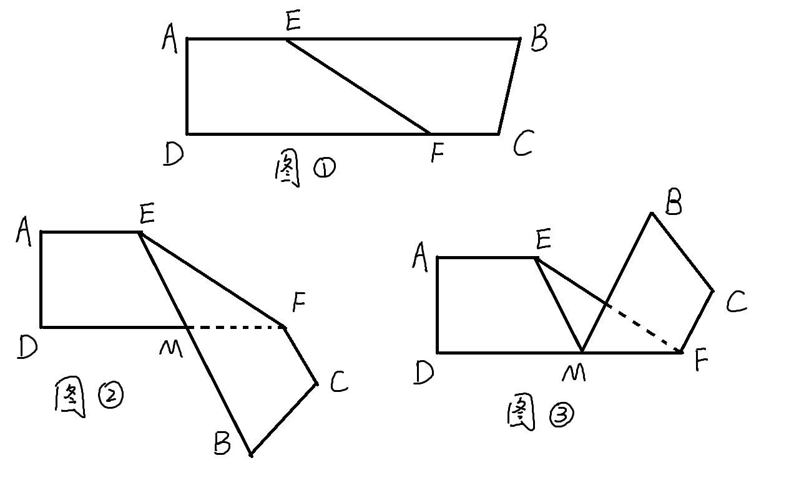

## 初一数学 平行与折叠填空题

$$
\begin{align}
& 如图，图1是四边形纸条ABCD，其中AB \parallel CD\\
& E，F分别为边AB，CD上的两个点， \\
& 将纸条ABCD沿EF折叠得到图2， \\
& 再将图2沿DF折叠得到图3，在图3中，\\
& 若\angle FEM = 26 ^\circ， 则\angle EFC的度数为 \text {______} \\
\end{align}
$$

### 解答
**答案是102°**

$$
\begin{align}
& 图1中: \\
& \because AB \parallel CD, \therefore \angle EFD = \angle FEB \\
& \angle EFC = 180^\circ - \angle EFD \\
& 图2中: \\
& \angle BEF = \angle MEF = 26 ^\circ \\
& \therefore \angle MFE = \angle EFD = 26 ^\circ \\
& \angle EFC = 180^\circ - 26 ^\circ = 154 ^\circ \\
& \angle MFC = \angle EFC - \angle MFE \\
&  =  154 ^\circ - 26 ^\circ = 128 ^\circ  \\
& 图3中: \\
& \angle EFC = \angle MFC - \angle MFE \\
& =  128 ^\circ - 26 ^\circ = 102 ^\circ  \\
\end{align}
$$
