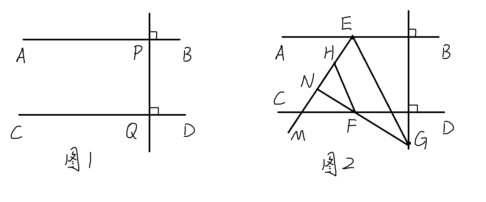
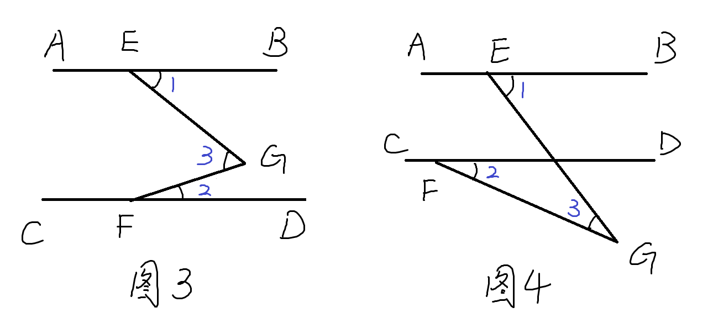
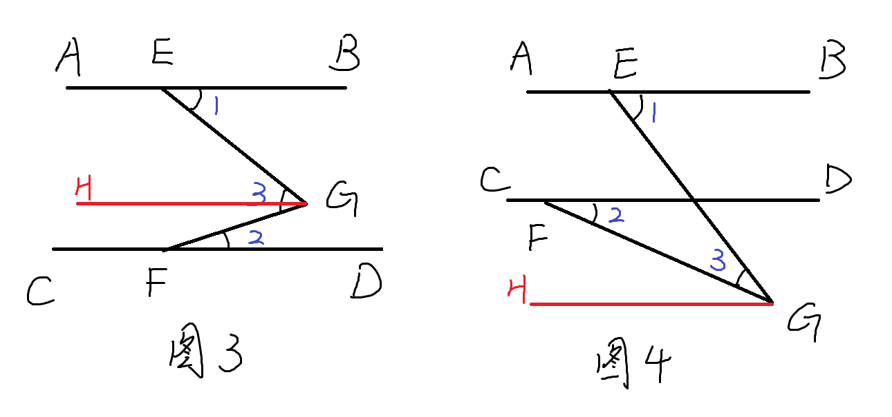
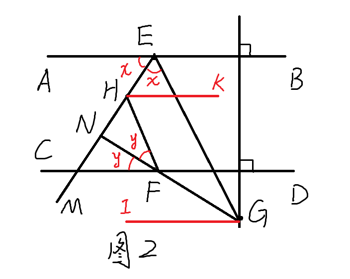
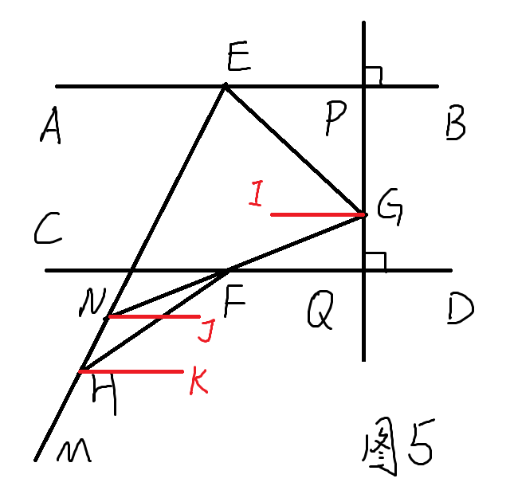

## 初一数学压轴题 平行线与求角度

$$
\begin{aligned}
& \text{如图1， 已知直线PQ分别与直线AB，CD交于点P和点Q, } \\
& AB \perp PQ, CD \perp PQ. \\
(1) & \text{求证: } AB \parallel CD \\
(2) & \text{如图2， P, Q两点分别沿直线AB和CD向左平移相同的 } \\
& \text{ 单位长度得到E， F两点，点G在直线PQ上运动，} \\
& \text{ EM平分} \angle AEG，\text{ 点H 在直线EM上，连接FH，} \\
& \text{ GF的延长线交EM于点N， FN平分} \angle CFH.\\
& \text{ ① 若} \angle CFH \lt 90 ^\circ, 2\angle EHF + \angle EGF = 255 ^\circ, \\
& \quad 求 \angle CFH 的大小  \\
& \text{ ② 当点G在AB， CD之间时， 直接写出}\\
& \quad \angle ENF, \angle EGF, \angle EHF 之间的数量关系 \\
\end{aligned}
$$

---

### 解答

(第一问非常简单, 主要是第2问难)
#### 第1问证明如下
$$
\begin{aligned}
& \because AB \perp PQ, CD \perp PQ \\
& \therefore \angle APQ = \angle PQD = 90 ^\circ \\
& \therefore AB \parallel CD
\end{aligned}
$$

#### 解答第二问之前，先熟悉一个模型：

$$
\begin{aligned}
& 如图（图3图4），AB \parallel CD，探究\angle 1, \angle 2, \angle 3 的关系 \\
\end{aligned}
$$

---

#### 第二问前置模型探究

$$
\begin{aligned}
& 过G作GH \parallel AB, \because AB \parallel CD, \therefore GH \parallel CD  \\
& 图3有, \angle 3 = \angle EGH + \angle FGH = \angle 1 + \angle 2 \\
& 图4有, \angle 3 = \angle EGH - \angle FGH = \angle 1 - \angle 2 \\
&  \\
\end{aligned}
$$

第二问除了使用该模型外，还使用了一个经典的技巧：
遇到角平分线时，将两个半角用同一个东西表示，
然后去表示其他的角（导出其他角度）。

#### 第2题第1小问解答

$$
\begin{aligned}
& 过H作 HK \parallel AB,  \\
& 过G作 GI \parallel AB,  \\
& \because AB \parallel CD, \\
& \therefore HK \parallel CD, GI \parallel CD   \\
& \because EM 平分\angle AEG, \\
&  FN 平分\angle CFH. \\
& \therefore 设 \angle AEM = \angle GEM = x, \\
& \angle CFN = \angle HFN = y \\
\end{aligned}
$$

$$
\begin{aligned}
& \therefore \angle EHK = \angle AEH = x, \angle FHK = \angle CFH = 2y \\
& \therefore \angle EHF = \angle EHK + \angle FHK = x + 2y \\
& \angle FGI = \angle NFC = y \\
& \angle EGI = 180^\circ - \angle AEG = 180^\circ - 2x \\
& \therefore \angle EGF = \angle EGI - \angle FGI = 180^\circ - 2x - y \\
& \because 2\angle EHF + \angle EGF = 255 ^\circ \\
& \therefore 2(x+2y) + 180^\circ - 2x - y = 255 ^\circ \\
& 解得 y = 25^\circ, \therefore \angle CFH = 2y = 50^\circ \\
\end{aligned}
$$

#### 第2题第2小问解答
这一问需要自己画出图象

$$
\begin{aligned}
& 过H作 HK \parallel AB,  \\
& 过G作 GI \parallel AB,  \\
& 过N作 NJ \parallel AB,  \\
& 同样 设 \angle AEM = \angle GEM = x, \\
& \angle CFN = \angle HFN = y \\
& 同理易得 \\
& 
\begin{cases}
\angle EHF = x - 2y \\ 
\angle EGF = 180^\circ - 2x + y  \\ 
\angle ENF = x - y \\ 
\end{cases}
\end{aligned}
$$

下来的难点就是如何由这三个式子探究三个角的关系

---

三个角的关系式中不再含有x，y，
所以这里的关键就是消元(消掉x，y)。

加减消元不好凑（有点靠感觉）
所以要将x,y用两个角表示出来，带入第三个式子。
这里考察了对二元一次方程组的灵活运用。

$$
\begin{aligned}
& 记 \angle EHF = m, \angle ENF = n, 则 \\
& \begin{cases}
m = x - 2y \\ 
n = x - y
\end{cases}\\ 
& 解得 \\ 
& \begin{cases}
x = 2n-m \\
y = n-m \\ 
\end{cases}\\ 
& 带入 \angle EGF = 180^\circ - 2x + y 得 \\
& \angle EGF = 180^\circ - 2 (2n-m)+ (n-m) \\
& 化简得\angle EGF +3n -m = 180^\circ \\
& 即 \angle EGF +3\angle ENF - \angle EHF = 180^\circ  \\
\end{aligned}
$$
