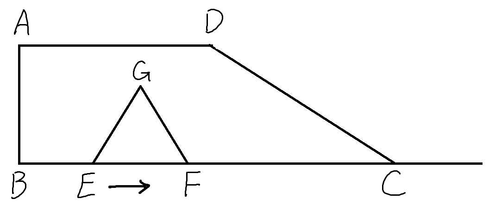

## 【初中数学压轴题】 二次函数动点问题
### 题目
> 适用阶段：初三上学期。（学完二次函数后）

$$
\begin{align}
& 如图，在梯形ABCD中，AD \parallel BC, \angle B = 90 ^\circ. \\
& BC=6, AD = 3, \angle DCB = 30^\circ. \\
& 点E, F 同时从点B出发，沿射线BC向右匀速移动.\\
& 已知点F的移动速度是点E的移动速度的2倍.\\
& 以EF为一边在BC的上方做等边三角形EFG.\\
& 设点E的移动距离为x(x>0),E移动到C时停止（x \leq 6 ) \quad \\
& 记\triangle EFG与梯形ABCD 重叠部分的面积为y\\
& 求y与x之间的关系式 (0 < x \leq 6)。
\end{align}
$$

---
解答见下方。
本段为分隔符，无实际意义。
只是防止直接看到解答影响思路。
。
。
。
。
。
。
。
。
。
。

---

### 思路概括
这种运动题目，
1. 首先有个准备工作：
图中重要的边(未来计算可能会用到的)，能求的求出来，能用x表示的都尽量表示出来。
2. 然后分析其运动过程，
找到运动中，所求值的形式或求法发生变化的关键时刻，
3. 再用这些时刻将整个运动过程分段，
然后分段解决问题。

### 详细分析
#### 准备工作1-算出直角梯形的高

$$
做DH \perp BC 于 H，
则 BH = AD = 3, HC = 3 \\
\because \angle DCH = 30 ^\circ, \therefore HC = \sqrt 3 DH，  \\ AB = DH = HC \div \sqrt 3 = \sqrt 3 \\
$$

计算完后，如下图

#### 准备工作2-用x表示需要的边
$$
BE = x，点F的速度是E的2倍\\
\therefore BF = 2x, EF = BF-BE = x .\\
作GN \perp BC 于N , GM \perp AB 于 M \\
等边\triangle GEF 三线合一，所以 EN = \frac 1 2 EF = \frac 1 2 x, \\
\angle EGN = \frac 1 2 \angle EGF = 30 ^\circ, \\
\therefore MB = GN = \sqrt 3 EN = \frac {\sqrt 3} {2} x
$$

#### 运动过程分析——分段
下来分析运动过程重，重叠部分面积的计算方法发生变化的关键时刻。
运动大致分为以下三阶段
1.  G在AD下方

2.  G在AD上方，F在C左侧

3.  G在AD上方，F在C右侧

这三个阶段的分界点情况如下
- 1和2的分界情况是G落在AD上

$$
此时 GN = AB = \sqrt 3 , 又GN = \frac {\sqrt 3} 2 x , \therefore x = 2 , \\
GM = \frac 3 2 x = 3 = DA, \therefore G 和D 重合
$$
- 2和3的分界情况是F和C重合

$$
此时 BF = BC = 6, 又BF = 2x , \therefore x = 3
$$

#### 分段计算

$$
\begin{align}
当0 < x \leq 2时，
y &= S_{\triangle GEF} = \frac 1 2 EF \cdot GN \\
&= \frac 1 2 x \cdot \frac {\sqrt 3} 2 x = \frac {\sqrt 3} 4 x^2
\end{align}
$$

$$
\begin{align}
&当2 < x \leq 3时，记GE, GF与DC交点分别为P, Q \\
&\angle PEC = 60 ^\circ,\angle QCE = 30^\circ, \therefore EPC = 90^\circ \\
y &= S_{PEFQ} = S_{\triangle GEF} - S_{\triangle GPQ}, 前文得S_{\triangle GEF} = \frac {\sqrt 3} 4 x^2 \\
&\angle G = 60 ^\circ, \angle GQP = 30 ^\circ, \therefore PQ = \sqrt 3 PG \\
&PG = GE - PE = GE - \frac 1 2 EC   \\
& \therefore EC = 6-x, PG = x - \frac {6-x} 2 = \frac {3x-6} 2 \\
S_{\triangle GPQ} &= \frac 1 2 GP \cdot QP = \frac 1 2 GP \cdot \sqrt 3 GP  = \frac {\sqrt 3} 2 (\frac {3x-6} 2) ^2 \\
&= \frac {\sqrt 3} 2 (\frac {9x^2-36x + 36} 4) = \frac { 9\sqrt 3} 8 x^2 - \frac { 9\sqrt 3} 2 x + \frac { 9\sqrt 3} 2 \\
y &= S_{\triangle GEF} - S_{\triangle GPQ} = \frac {\sqrt 3} 4 x^2 - (\frac { 9\sqrt 3} 8 x^2 - \frac { 9\sqrt 3} 2 x + \frac { 9\sqrt 3} 2) \\
&=  - \frac {7\sqrt 3} 8 x^2 + \frac { 9\sqrt 3} 2 x - \frac { 9\sqrt 3} 2
\end{align}
$$

$$
\begin{align}
&当3 < x \leq 6时，记GE与DC交点为P\\
&同理有\angle EPC = 90^\circ, \angle PCE = 30 ^\circ, \\
&PE = \frac 1 2 EC = \frac 1 2 (6-x), PC = \sqrt 3 PE = \frac {\sqrt 3} 2 (6-x)\\
y & = S_{\triangle PEC} = \frac 1 2 PE \cdot PC = \frac 1 2 \cdot \frac 1 2 (6-x) \cdot \frac {\sqrt 3} 2 (6-x) \\
& = \frac {\sqrt 3} 8 (6-x) ^2 = \frac {\sqrt 3} 8 (x^2 - 12x + 36 ) \\
& = \frac {\sqrt 3} 8 x^2 - \frac {3\sqrt 3} 2 x + \frac {9\sqrt 3} 2
\end{align}
$$

### 参考答案
