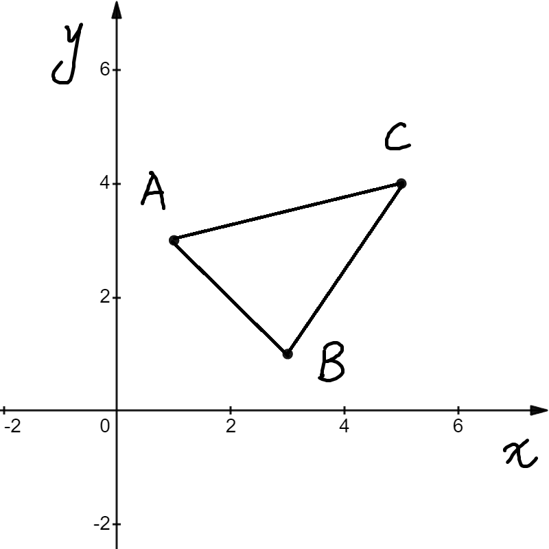
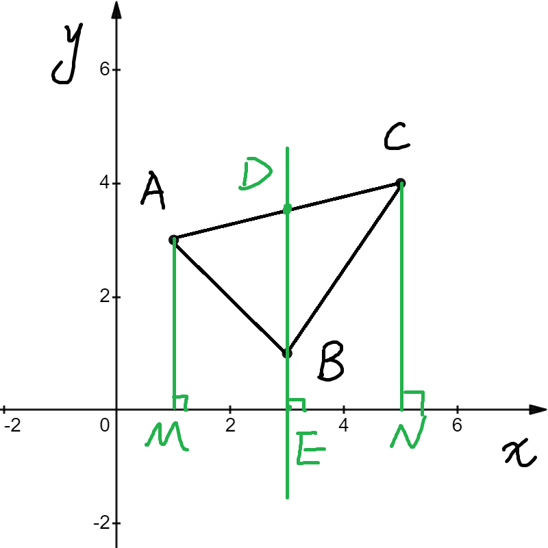
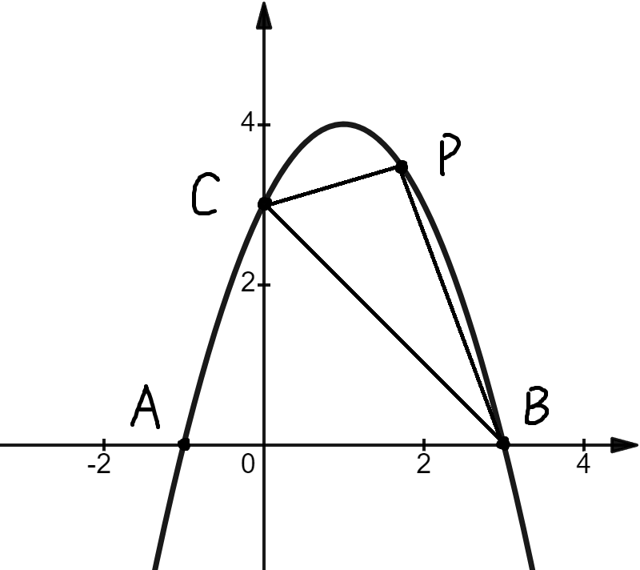
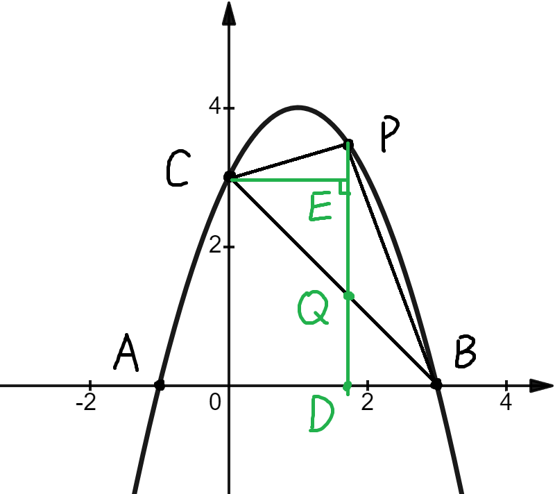
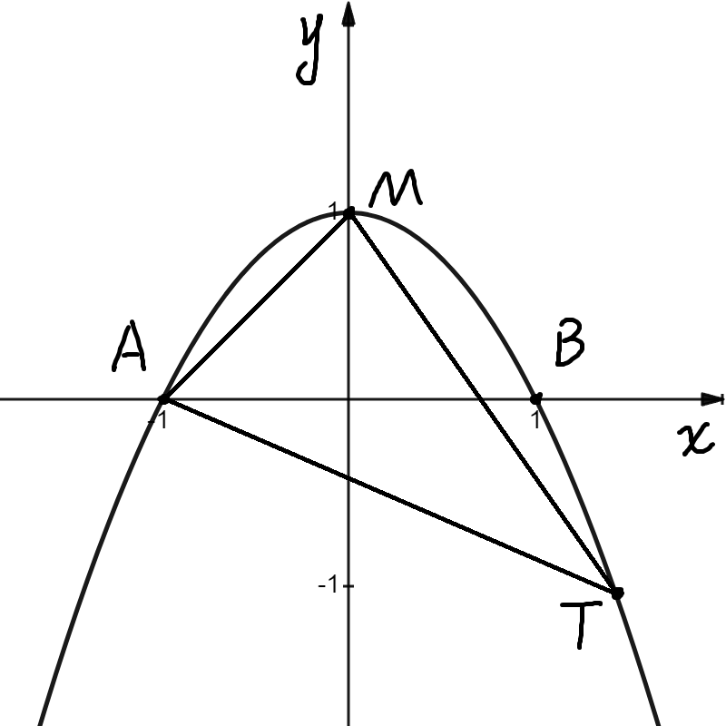
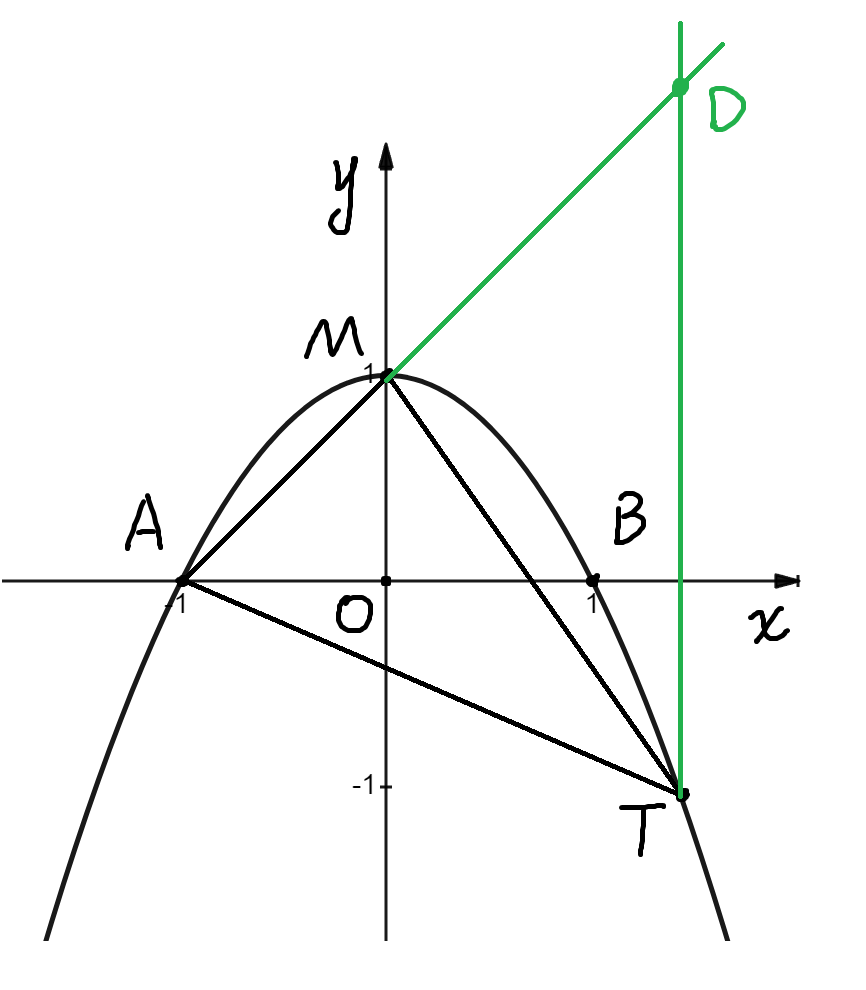
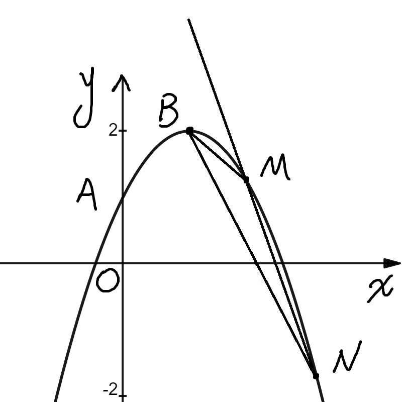
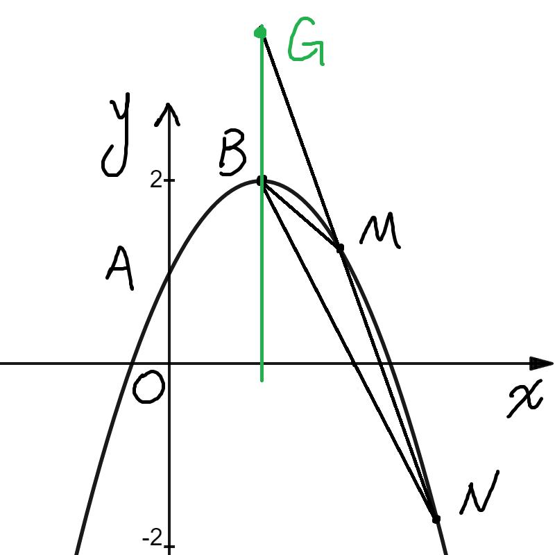

## 初三数学 二次函数与面积问题 铅锤法专题
> 二次函数与面积问题，常用铅锤法与割补法。
> 本节为铅锤法专题， 作者: bigshuang2020

### 导引
先通过一个简单的例子来认识铅锤法

$$
如图，在平面直角坐标系中\\
点A(1,3), B(3,1), C(5, 4), 求 \triangle ABC 的面积
$$

铅锤法通用过程如下

$$
\begin{aligned}
&如图，过点D作直线平行于y轴，交AC所在直线于点C, 交x轴与点E\\
& 作AM\perp x轴于点M, 作AN\perp x轴于点N  \\
S_{\triangle ABC} & = S_{\triangle ABD} + S_{\triangle CBD} \\
& = \frac 1 2 BD \cdot ME  + \frac 1 2 BD \cdot EN \\
& = \frac 1 2 BD \cdot (ME + EN) \\
& = \frac 1 2 BD \cdot MN \\
\end{aligned}
$$
铅锤法可以这么理解
平面直角坐标系中
$$
S_{\triangle} = \frac 1 2 水平宽 \cdot 铅锤高
$$
具体到上图
MN为水平宽， BD为铅锤高

下来结合具体的值来求出面积
$$
\begin{aligned}
& 对于小题，可以快速求AC解析式 \\
& k_{AC} = \frac {y_C - y_A} {x_C - x_A} = \frac {4-3} {5-1} = \frac 1 4 \\
& 设直线AC解析式为 y = \frac 1 4 x + b \\
& 代入A(1,3), 有3 = \frac 1 4 + b , 解得 b = \frac {11} 4\\
& \therefore AC: y = \frac 1 4 x + \frac {11} 4, 当x= 3时， y = \frac 1 4 \cdot 3 + \frac {11} 4 = \frac 7 2\\
& 即D为(3, \frac 7 2), \therefore BD = y_D - y_B = \frac 7 2 - 1 = \frac 5 2 \\
& MN = x_C - x_A = 5 - 1 = 4 \\
& S_{\triangle ABC} = \frac 1 2 BD \cdot MN = \frac 1 2 \cdot \frac 5 2 \cdot 4 = 5\\
& \\
& \\
\end{aligned}
$$

### 经典

$$
\begin{aligned}
&如图，抛物线y=-x^2+2x+3 与x轴交于A(-1,0), B(3,0)两点 \\
&与y轴交于点C。点P为抛物线第一象限上一动点，连接PB，PC，BC\\
&求\triangle PBC 面积的最大值，并求出此时点P的坐标。
\end{aligned}
$$

**答案**
$$
\begin{aligned}
& 如图，作PD \perp x 轴， 垂足为D，交BC于点Q, 作CE \perp PD 于点E \\
& y=-x^2+2x+3， 当x=0时，y=3，\therefore C为(0,3) \\
& 设直线BC的解析式为y=kx+b\\
& 将点B(3, 0), C(0, 3)带入得
\begin{cases}
3k+b=0 \\
b=3
\end{cases}
\quad, 解得\begin{cases}
k=-1 \\
b=3
\end{cases}\\
& \therefore 直线BC的解析式为 y = -x+3\\
& \\
& 设P为(t, -t^2+2t+3) (0\lt t \lt 3), 则Q为(t, -t+3)\\
S_{\triangle PBC} & = S_{\triangle PQC} + S_{\triangle PQB}\\
& = \frac 1 2 PQ \cdot CE + \frac 1 2 PQ \cdot BD\\
& = \frac 1 2 PQ \cdot (CE+BD)\\
& = \frac 1 2 PQ \cdot OB\\
& = \frac 3 2 PQ \\
& \\
PQ &= y_P - y_Q \\
&= -t^2+2t+3 - (-t+3) \\
&= -t^2+3t \\
& 当t = - \frac {3} {2\times (-1)} = \frac 3 2 时 \\
& PQ取最大值，为-(\frac 3 2)^2+3 \times \frac 3 2 = \frac 9 4\\
& 此时S_{\triangle PBC} 最大，为\frac 3 2 \times \frac 9 4 = \frac {27} 8\\
& y_P = -(\frac 3 2)^2+2\times \frac 3 2 +3 = \frac {15} 4\\
& \therefore 点P为(\frac 3 2, \frac {15} 4)
\end{aligned}
$$

---

铅垂法过程还可以这样写

$$
\begin{aligned}
S_{\triangle PBC} & = S_{\triangle PQC} + S_{\triangle PQB}\\
& = \frac 1 2 PQ \cdot (x_P - x_C) + \frac 1 2 PQ \cdot (x_B - x_P)\\
& = \frac 1 2 PQ \cdot (x_P - x_C+x_B - x_P)\\
& = \frac 1 2 PQ \cdot (x_B-x_C)
\end{aligned}
$$

求面积步骤可简化： 合到一起写
$$
\begin{aligned}
S_{\triangle PBC} & = S_{\triangle PQC} + S_{\triangle PQB}\\
& = \frac 1 2 PQ \cdot CE + \frac 1 2 PQ \cdot BD\\
& = \frac 1 2 PQ \cdot (CE+BD)\\
& = \frac 1 2 PQ \cdot OB\\
& = \frac 3 2 [-t^2+2t+3 - (-t+3)] \\
&= -\frac 3 2 t^2+ \frac 9 2 t \\
& 当t = - \frac {\frac 9 2} {2\times (-\frac 3 2)} = \frac 3 2 时 \\
& S_{\triangle PBC} 取最大值，为\frac 3 2 \times \frac 9 4 = \frac {27} 8\\
& y_P = -(\frac 3 2)^2+2\times \frac 3 2 +3 = \frac {15} 4\\
& \therefore 点P为(\frac 3 2, \frac {15} 4)
\end{aligned}
$$

### 变体
> 简单变了个形，但还是可以继续使用铅锤法

$$
\begin{aligned}
&如图， 抛物线的顶点为M(0,1), 与x轴的交于点A(-1, 0)和点B. \\
(1)& 求该抛物线的解析式。\\
(2)& T为直线AM下方抛物线上的一点，且S_{\triangle TAM} = 2, 求T点的坐标
\end{aligned}
$$

解答
$$
\begin{aligned}
(1) & \because 抛物线的顶点为M(0,1) \\
& 设解析式为 y = ax^2 + 1 \\
& 将A(-1, 0)带入，得 0 = a\cdot (-1)^2 + 1 \\
& 解得a = -1, \therefore 抛物线解析式为 y = -x^2 + 1
\end{aligned}
$$

$$
\begin{aligned}
(2) & 过点T作y轴的平行线，交AM所在直线于点D\\
S_{\triangle AMT} & = |S_{\triangle ADT} - S_{\triangle MDT}| \\
& = |\frac 1 2 DT \cdot |x_G-x_A| - \frac 1 2 DT \cdot |x_G-x_M| | \\
& = \frac 1 2 DT \cdot ||x_G-x_A| - |x_G-x_M||\\
\because & T在AM直线下方  \\
当T在A左边时，& ||x_G-x_A| - |x_G-x_M|| \\
= & \;  |x_A - x_G - (x_M- x_G)| = x_M -x_A\\
当T在A右边时，& ||x_G-x_A| - |x_G-x_M|| \\
= & \; |x_G-x_A - (x_G-x_M)| = x_M -x_A\\
\therefore S_{\triangle AMT} & = \frac 1 2 DT (x_M -x_A)\\
& \\
& 对于抛物线 y = -x^2 + 1\\
& 当y = 0 时，-x^2 + 1 = 0 \\
& 解得 x = \pm 1, \therefore 点A为(-1, 0), B为(1, 0)\\
& \therefore x_M -x_A = 0 - (-1) = 1\\
& \because S_{\triangle AMT} = 2 = \frac 1 2 DT (x_M -x_A) \\
& \therefore DT = 4\\
& \\
& 设直线AM的解析式为y=kx+b\\
& 将点A(-1, 0), M(0, 1)带入得
\begin{cases}
-k+b=0 \\
b=1
\end{cases}
\quad, 解得\begin{cases}
k=1 \\
b=1
\end{cases}\\
& \therefore 直线AM的解析式为 y = x+1\\
& 设T为(t, -t^2+1) (t \le -1 或 t \gt 0), 则D为(t, t+1)\\
& \because T在直线AM下方 \\
\therefore DT &= y_D - y_T \\
&= t+1 - (-t^2 + 1) \\
&= t^2 + t \\
& \therefore t^2 + t = 4 \\
& 解得 t_1 = \frac {-1\ + \sqrt{17}} 2 , t_2 = \frac {-1\ - \sqrt{17}} 2\\
& y_T = y_D - DT = (t+1)-4 = t-3\\
& \frac {-1\ + \sqrt{17}} 2  - 3 = \frac {-7\ + \sqrt{17}} 2 \\
& \frac {-1\ - \sqrt{17}} 2  - 3 = \frac {-7\ - \sqrt{17}} 2 \\
\therefore & T 的坐标为 (\frac {-1\ + \sqrt{17}} 2 , \frac {-7\ + \sqrt{17}} 2) 或 ( \frac {-1\ - \sqrt{17}} 2, \frac {-7\ - \sqrt{17}} 2)\\
\end{aligned}
$$

> 这个第二问求坐标，还可以用平行线法

**解法2： 平行线法**

$$
\begin{aligned}
(2) & 过点T作TQ 平行于 AM 交 x轴 于点Q, 连接MQ \\
& \because 平行线间距离处处相等 \\
& 以AM为底， \triangle TAM 和 \triangle QAM 等高 \\
& \therefore S_{\triangle TAM } = S_{\triangle QAM} = 2\\
& S_{\triangle QAM} = \frac 1 2 AQ \cdot MO = \frac 1 2 (x_Q - x_A) \cdot y_M = 2\\
& 解得 x_Q = 3 , 点Q为(3, 0)\\
& \\
& 设AM所在直线解析式为 y = kx+1\\
& 代入A(-1,0), 有0 = -k + 1, 解得k = 1\\
& TQ // AM , 设TQ所在直线为 y = x + b\\
& 代入Q(3,0), 有0 = 3 + b, 解得b = -3\\
& \therefore 直线TQ 解析式为 y = x-3\\
& \\
& T为直线TQ与二次函数抛物线交点\\
& 联立
\begin{cases}
y=-x^2 +1 \\
y = x -3
\end{cases}
\quad 得 \quad x^ 2 + x - 4 = 0\\
& 解得 x_1 = \frac {-1\ + \sqrt{17}} 2 , x_2 = \frac {-1\ - \sqrt{17}} 2\\
& y_1 = x_1-3 = \frac {-1\ + \sqrt{17}} 2  - 3 = \frac {-7\ + \sqrt{17}} 2 \\
& y_2 = x_2-3  = \frac {-1\ - \sqrt{17}} 2  - 3 = \frac {-7\ - \sqrt{17}} 2 \\
\therefore \; & T 的坐标为 (\frac {-1\ + \sqrt{17}} 2 , \frac {-7\ + \sqrt{17}} 2) 或 ( \frac {-1\ - \sqrt{17}} 2, \frac {-7\ - \sqrt{17}} 2)
\end{aligned}
$$

### 进阶
> 结合考察了一次函数与二次函数交点
> 以及一元二次方程的根与系数关系

$$
\begin{aligned}
& 抛物线 y=-x^2+ax+c 经过点A(0,1), 与它的对称轴直线x=1交于点B. \\
(1) & 求抛物线的解析式 \\
(2) & 如图，过定点的直线y=kx-k+4(k<0)与抛物线交于点M, N，\\
& 若\triangle BMN 的面积等于1，求k的值
\end{aligned}
$$

解答
$$
\begin{aligned}
(1) & 将点A(0,1)带入抛物线 y=-x^2+ax+c，得 c = 1 \\
& 对称轴 x = - \frac a {2\times (-1)} = 1, 解得 a = 2 \\
& \therefore 抛物线的解析式 y = -x^2+2x+1
\end{aligned}
$$

$$
\begin{aligned}
(2) & 过点B作y轴的平行线，交MN所在直线于点G\\
S_{\triangle BMN} & = S_{\triangle BGN} - S_{\triangle BGM} \\
& = \frac 1 2 BG(x_N-x_B) - \frac 1 2 BG(x_M-x_B) \\
& = \frac 1 2 BG(x_N-x_B - x_M+x_B) \\
& = \frac 1 2 BG(x_N-x_B - x_M+x_B) \\
& = \frac 1 2 BG(x_N - x_M) \\
& \\
& \because x_G = x_B = 1\\
& \therefore y_B = -1^2+2 \times 1 +1 = 2, y_G = k-k+4 = 4 \\
& \therefore BG = y_G-y_B = 4-2=2\\
& \therefore S_{\triangle BGM} = \frac 1 2 \cdot 2 (x_N - x_M) = 1\\
& \therefore x_N - x_M = 1\\
& \\
& 联立抛物线y = -x^2+2x+1与直线 y=kx-k+4 \\
& \begin{cases}
y = -x^2+2x+1 \\
y=kx-k+4
\end{cases} \\
& 得 x^2 + (k-2)x - k+3 = 0 \\
& x_N和x_M 就是它的两个解 \\
& 根据一元二次方程根与系数的关系，有 \\
& x_N + x_M = 2-k, x_N \cdot x_M = 3-k \\
& \\
\therefore (x_N - x_M)^2 &= (x_N+x_M)^2 - 4x_N\cdot x_M \\
& = (2-k)^2 - 4(3-k) \\
& = k^2 - 4k + 4 - 12 + 4k \\
& = k^2 - 8 \\
& 由x_N - x_M = 1得 k^2 - 8 = 1 \\
& 解得 k = \pm 3 \\
& \because k \le 0, \therefore k = -3
\end{aligned}
$$
