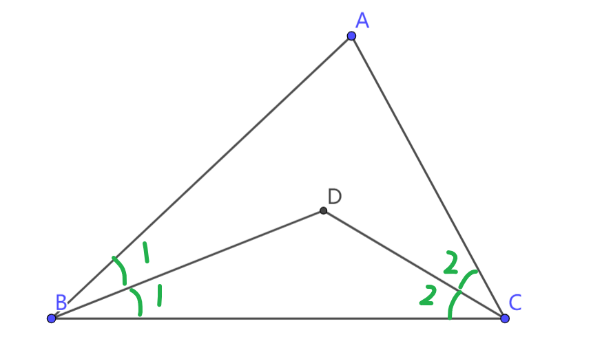
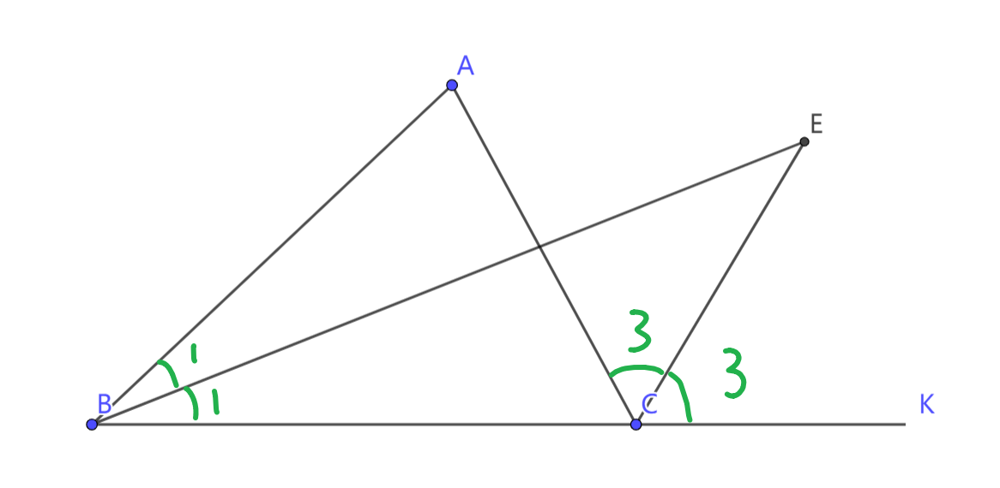
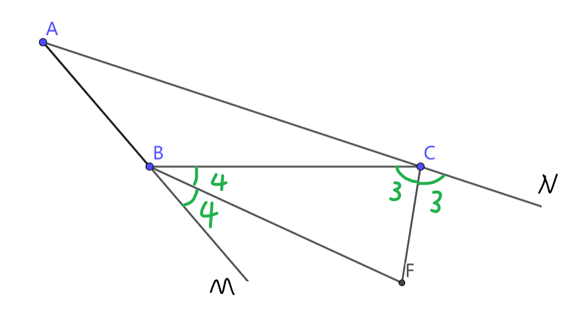

## 三角形的角平分线

三角形两个角平分线构成的角，
与三角形另一个角的关系探究。
结论不必掌握，重要的是
掌握过程中使用的方法与核心基础定理。

### 核心基础定理
- 三角形内角和为180°
- 三角形的外角等于
  不相邻两个内角之和。

### 1 两个内角的角平分线

$$
\begin{align}
&如图，\triangle ABC中，\\
&\angle B 和 \angle C 的角平分线相交于点D \\
&探究 \angle D 和 \angle A的关系
\end{align}
$$

$$
\begin{align}
&\because\triangle ABC的内角和为180^\circ & \\
&\therefore\angle A+2\angle 1+2\angle 2=180^\circ  \tag{1} \\
&\because\triangle DBC的内角和为180^\circ & \\
&\therefore\angle D+\angle 1+\angle 2=180^\circ \tag{2} \\
\\
& (要探究 \angle D 和 \angle A的关系，\\
&就要把上面两个公式中的\angle 1+\angle 2消去。) \\
\\
& 2 \times (2)-(1)得 \\
& 2  \angle D - \angle A = 180^\circ\\
&\therefore \angle A = 2\angle D - 180^\circ \\
&\therefore \angle D = \frac {1} {2}\angle A + 90^\circ \\
\end{align}
$$

### 2 一个内角一个外角的角平分线

$$
\begin{align}
& 如图，\triangle ABC中，\angle B 的角平分线 和 \\
& \angle C 的外角平分线相交于点E \\
& 探究 \angle E 和 \angle A的关系
\end{align}
$$

$$
\begin{align}
&\because 三角形的外角等于不相邻两个内角的和 \\
&\therefore 对于\triangle EBC， \angle 3 = \angle 1+ \angle E \tag{1} \\
&\therefore 对于\triangle ABC， 2\angle 3 = 2\angle 1+ \angle A \tag{2} \\
\\
& 由(1)和(2)可得 \\
& \angle A = 2\angle E \\
\end{align}
$$

### 3 两个外角的角平分线

$$
\begin{align}
& 如图，\triangle ABC中，\angle B 的外角平分线 和\\
& \angle C 的外角平分线相交于点F \\
& 探究 \angle F 和 \angle A的关系
\end{align}
$$

$$
\begin{align}
&\because\triangle FBC的内角和为180^\circ & \\
&\therefore \angle F = 180^\circ-\angle 3 - \angle 4 \tag{1} \\
&\because 三角形的外角等于不相邻两个内角的和 \\
&\therefore 2\angle 3 = \angle A + \angle ABC  \\
&\therefore 2\angle 4 = \angle A + \angle ACB  \\
&\therefore 2\angle 3 + 2\angle 4\\
& = \angle A + \angle ABC + \angle A + \angle ACB \\
& = (\angle A + \angle ABC + \angle ACB) + \angle A \\
& = 180^\circ +  \angle A \\
&即 \angle A = 180^\circ - 2\angle 3 - 2\angle 4
\tag{2} \\
\\
& (要探究 \angle A 和 \angle F 的关系，\\
&就要把上面两个公式中的\angle 3+\angle 4 消去。) \\
\\
& 2 \times (1)- (2)得 \\
& 2 \angle F - \angle A = 180^\circ \\
& 即 \\
& \angle A = 2 \angle F - 180^\circ \\
& \angle F = \frac{1} {2} \angle A + 90^\circ \\
\end{align}
$$
