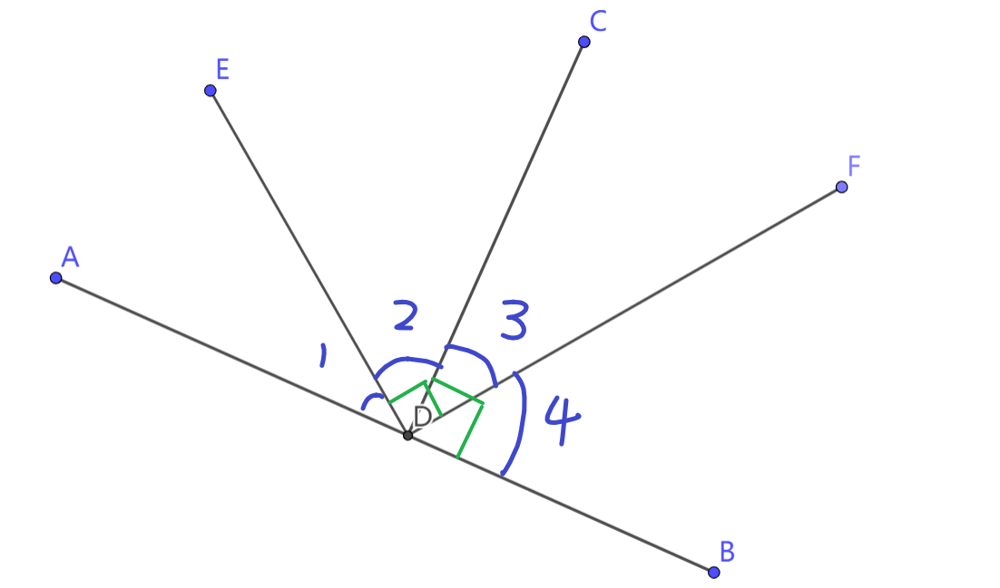
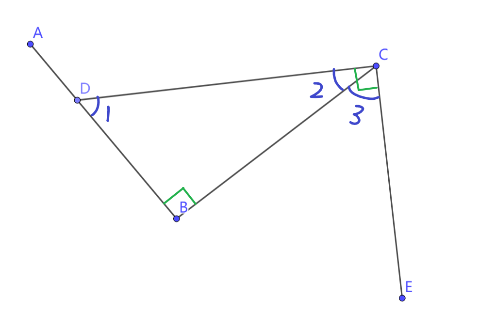
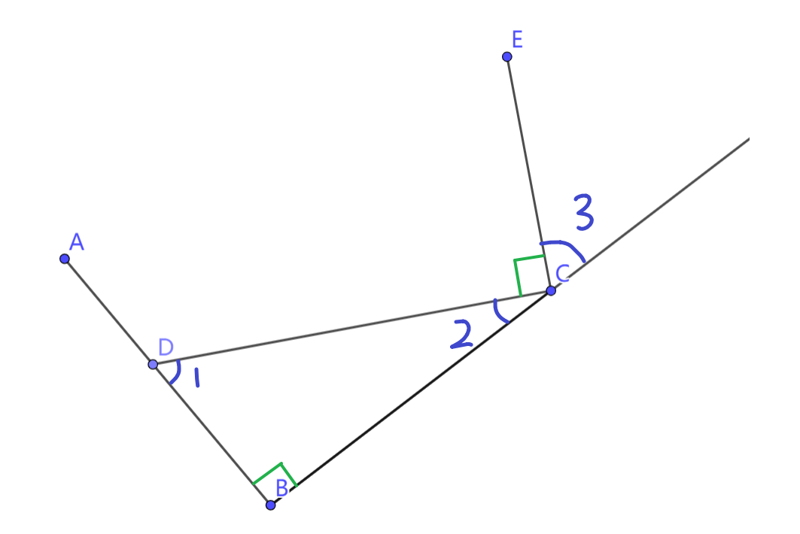

## 两个直角
两个直角关系探究
### 1 情况一

$$
\begin{align}
&如图，AB \perp CD， ED \perp DF \\
&寻找所有相等的角
\end{align}
$$

$$
\begin{align}
& \because AB \perp CD \\
& \therefore \angle 1 + \angle 2 = 90^\circ  \tag{1} \\
&  \quad \angle 3 + \angle 4 = 90^\circ \tag{2} \\
& \because ED \perp DF \\
& \therefore \angle 2 + \angle 3 = 90^\circ  \tag{3} \\
\\
& 由(1)和(3)可得 \\
& \angle 1 =  \angle 3 \\
& 由(2)和(3)可得 \\
& \angle 2 =  \angle 4
\end{align}
$$

### 2 情况二

$$
\begin{align}
&如图，AB \perp BC， CD \perp CE \\
&寻找所有相等的角
\end{align}
$$

$$
\begin{align}
& \because AB \perp BC \\
& \therefore \angle 1 + \angle 2 = 90^\circ  \tag{1} \\
& \because CD \perp CE \\
& \therefore \angle 2 + \angle 3 = 90^\circ  \tag{2} \\
\\
& 由(1)和(2)可得 \\
& \angle 1 =  \angle 3
\end{align}
$$

### 3 情况三

$$
\begin{align}
&如图，AB \perp BC， CD \perp CE \\
&寻找所有相等的角
\end{align}
$$

$$
\begin{align}
& \because AB \perp BC \\
& \therefore \angle 1 + \angle 2 = 90^\circ  \tag{1} \\
& \because CD \perp CE \\
& \therefore \angle 2 + \angle 3 = 180^\circ - 90^\circ = 90^\circ  \tag{2} \\
\\
& 由(1)和(2)可得 \\
& \angle 1 =  \angle 3
\end{align}
$$
