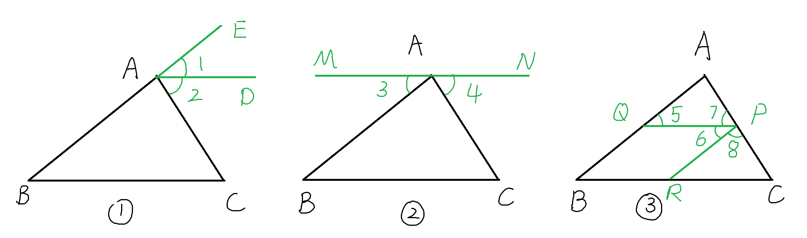

## 从平行到三角形及n边形内角和、外角和。

### 平行线的基本性质
1. 两直线平行，同位角相等。
2. 两直线平行，内错角相等。
3. 两直线平行，同旁内角互补。

2和3可以由1推出。

有这三个性质可以推理出三角形的内角和为180。
### 三角形内角和
其推理核心思路是凑平角。

具体有三种办法，如下三图所示

#### 图一
$$
\angle B = \angle 1 \\
\angle C = \angle 2 \\
\angle A + \angle B + \angle C = \angle A + \angle 1 + \angle 2=180 ^\circ
$$
#### 图二
$$
\angle B = \angle 3 \\
\angle C = \angle 4 \\
\angle A + \angle B + \angle C = \angle A + \angle 3 + \angle 4=180 ^\circ
$$

#### 图三
$$
\angle A = \angle 8 \\
\angle B = \angle 5 = \angle 6 \\
\angle C = \angle 7 \\
\angle A + \angle B + \angle C = \angle 8 + \angle 6 + \angle 7=180 ^\circ
$$

### n边形内角和
- 三角形： $180^\circ$
- 四边形(可以分成两个三角形)： $2 \times 180^\circ = 360^\circ$
- 五边形(可以分成三个三角形)： $3 \times 180^\circ = 540^\circ$
.......
- 五边形(可以分成n-2个三角形)： $(n-2) \times 180^\circ$

### n边形外角和
n边形总共有n个顶点，每个顶点的内角加外角是一个平角$180^\circ$
$$
内角和 + 外角和 = n \times 180^\circ \\
外角和 = (n-2) \times 180^\circ \\
内角和 = n \times 180^\circ - (n-2) \times 180^\circ \\
= 2 \times 180^\circ \\
= 360^\circ \\
$$
