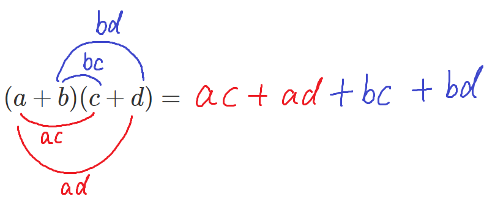
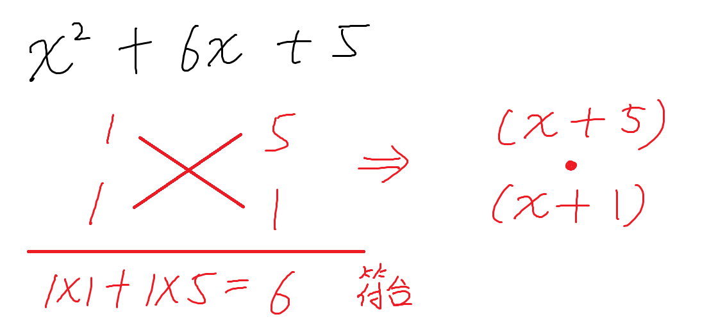
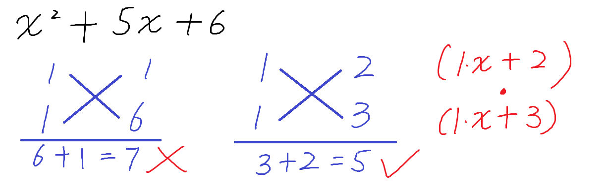
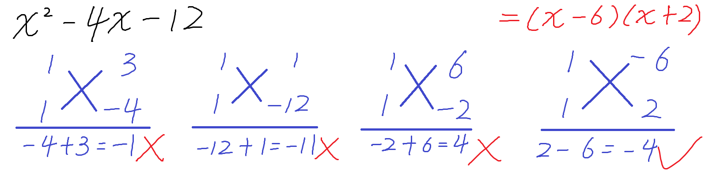
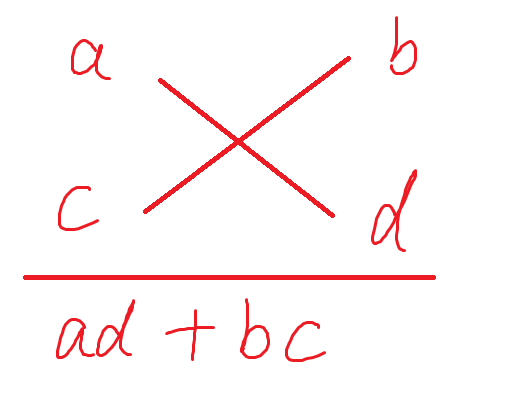
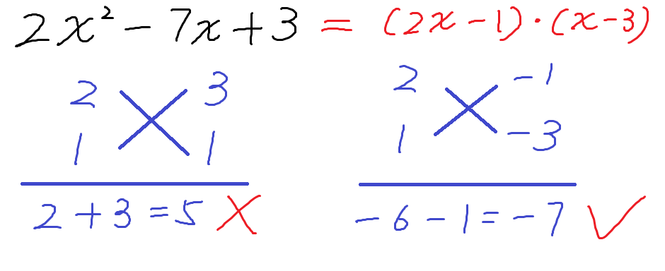

## 【初中数学】因式分解之十字交叉法

> 适用范围: 初二上学期（人教版。

### 前置知识
$(a+b)(c+d)$这样的式子怎样乘开

**思路**:
括号一个一个拆开。
先把一个括号看作整体，拆掉另一个括号。
比如把$(a+b)$看作一个整体，拆开$(c+d)$，则详细过程如下

$(a+b)(c+d) = (a+b)c + (a+b)d = ac + bc + ad +bd$

**结论**
上面的过程做熟了之后，就可以跳过中间步骤，直接算。
直接算的办法是，一个括号里面里面每一项都乘以另一个括号里面每一项，如下图所示。

补充：有正负号的话，就把符号带着一起运算。

**应用**
完全平方和公式，平方差公式的推导，

$$
\begin{align}
(a+b)^2 &= (a+b)(a+b) = aa + ab + ba + bb = a^2 + 2ab + b^2 \\
(a-b)^2 &= (a-b)(a-b) = aa - ab - ba + bb = a^2 - 2ab + b^2 \\
(x+y)(x-y) &= xx - xy + yx -yy = x^2 - y^2 \\
\end{align}
$$

### 因式分解之十字交叉
#### 原理

根据前面的结论，可以推导出
$(x+m)(x+n) = x^2 + mx + nx + mn = x^2 + (m+n)x + mn$

因式分解与整式乘法是方向相反的变形
故由上式可得：
$x^2 + (m+n)x + mn$可以分解为$(x+m)(x+n)$

#### 举例介绍
形如$x^2 + 6x + 5$的式子可以因式分解成什么？
对比$x^2 + (m+n)x + mn$可知，要找到一组整数$m$和$n$
使得$m+n=6$, $mn=5$
相乘为5的一组整数只有 1 和 5，$1+5=6$
所以$m=1$和$n=5$是满足的一组数。
($x^2$系数为1时，m和n是等价的，谁是1谁是5没区别。)

所以$x^2 + 6x + 5= (x+1)(x+5)$

**十字交叉法，其实就是上面的尝试过程的一个简化或者说一种表示方式。**

$x^2 + 6x + 5$例子的十字交叉形式如下

十字交叉的说明
- $x^2$的系数为1的时候，左边两个都可以写$1,1$（具体原理见后面拓展）
- 右边两个数写$5$(常数项)的一种分解可能，一组乘积为5的整数。
  这里只有一组可能$1$和$5$
- 这四个数字交叉相乘，检查做和之后的结果是否等于6($x$一次项的系数)。
  符合就代表分解成功，上面的两行就是分解后的两个式子的系数。

#### 举例加深理解
- $x^2 + 5x + 6$的十字交叉分解过程如下

所以 $x^2 + 5x + 6=(x+2)(x+3)$

- $x^2 - 4x -12$的十字交叉分解过程如下

所以 $x^2 - 4x -12=(x-6)(x+2)$

上图为了演示展示了很多不符合的情况，实际上熟悉了之后，很容易预判。

#### 拓展
有的朋友可能会想到。
只是想找到一组乘积与和分别为两个值的整数对，
更具体来说，对于常数项，想找到它的一种分解情况，和为一次项系数。

其实没必要写成上面的形式，有更简单的格式。

上面的十字交叉形式，其实只展示了$x^2$系数为1的特殊情况。
当$x^2$系数不为1时，就要计算更普遍的情况。

这个时候因式分解，对应的乘法运算如下
$(ax+b)(cx+d) = acx^2 + adx + bcx + bd = acx^2 + (ad +bc)x + bd$

反过来就是
$acx^2 + (ad +bc)x + bd$可以因式分解为$(ax+b)(cx+d)$

此时因式分解的图示是完全形态，如下

示例如下

即$2x^2 - 7x + 3 = (2x-1)(x-3)$
