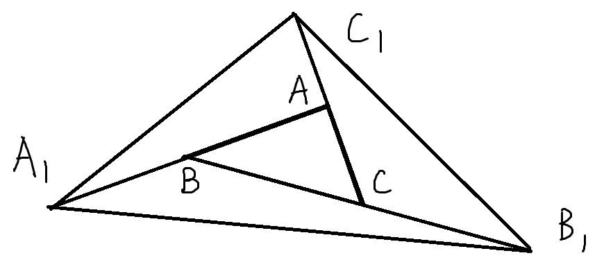
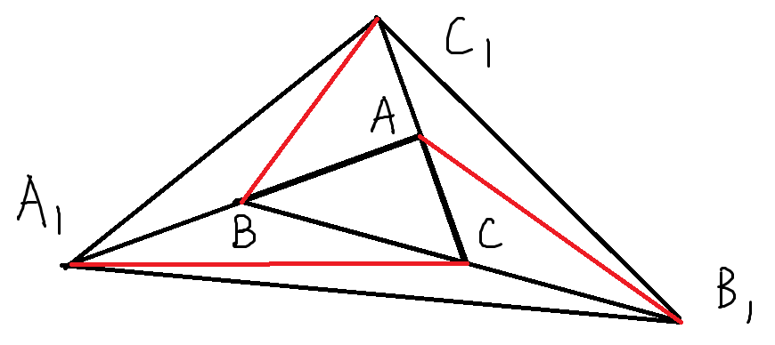
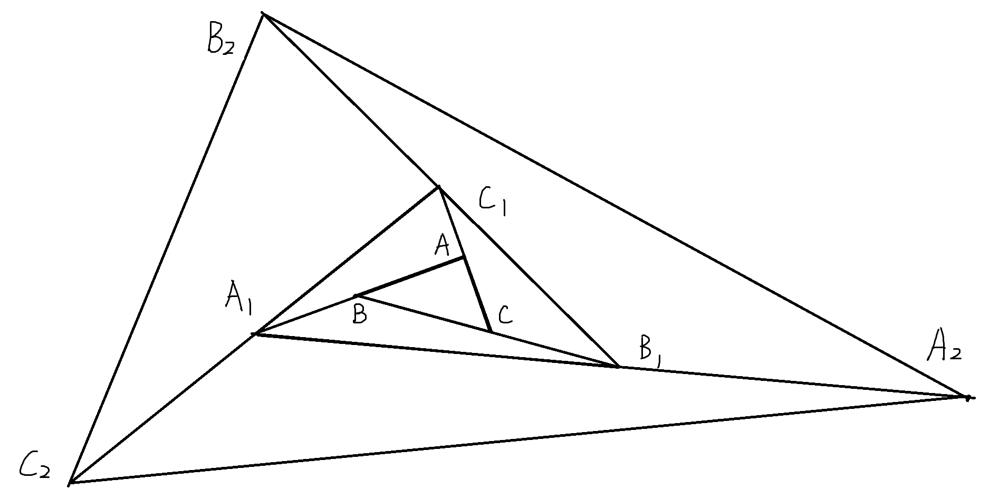

### 【初中数学】趣味题 三角形面积计算
> 适用阶段： 初二上学期
> 学完三角形(人教版 第十一章)。

### 题目
$$
如图， \triangle ABC 的面积为1,\\
第一次操作，分别延长 \\
AB, BC, CA 至点A_1, B_1, C_1,  \\
使得A_1B=AB, B_1C=BC, C_1A=CA, \\
顺次连接A_1, B_1, C_1, 得到\triangle A_1B_1C_1, \\
第二次操作，分别延长 \\
A_1B_1, B_1C_1, C_1A_1至点A_2, B_2, C_2, \\
使得A_2B_1=A_1B_1,  \\
B_2C_1=B_1C_1, C_2A_1=C_1A_1,\\
顺次连接A_2, B_2, C_2, 得到\triangle A_2B_2C_2, \\那么\triangle A_2B_2C_2 的面积是 \_\_\_\_\_\_.
$$

### 思路分析与解答
这里核心考察的就是
**同底等高**
两个三角形
底的长度相同
共用一个高(高相同)
则这两个三角形面积相等。

我们先来看第一次操作后的效果，如下图

$$
\begin{align}
& 连接AB_1, BC_1, CA_1, \\
& 观察\triangle ABC 和 \triangle ACB_1,  \\
& 他们的底相同(BC = CB_1), \\
&  底边上的高相同, 都是点A到BB_1的距离。\\
& \therefore S_{\triangle ACB_1} = S_{\triangle ABC} = 1 \\
& 再观察\triangle AB_1C_1 和 \triangle ACB_1,  \\
& 他们的底相同(C_1A = AC), \\
& 底边上的高相同, 都是点B_1到CC_1的距离。\\
& \therefore S_{\triangle AB_1C_1} = S_{\triangle ACB_1} = 1 \\
& 同理可得，其他小三角形的面积也为1。\\
& 即 S_{\triangle A_1BC_1} = S_{\triangle BAC_1} \\
& = S_{\triangle A_1BC} = S_{\triangle A_1CB_1} = 1\\
& \triangle A_1B_1C_1 里共有7个小三角形，\\
& \therefore S_{\triangle A_1B_1C_1} = 7\\
\end{align}
$$

同理可得
$S_{\triangle A_2B_2C_2} = 7 S_{\triangle A_1B_1C_1} = 49$

**正确答案是49**

完整图像如下（画出$A_2B_2C_2$)

