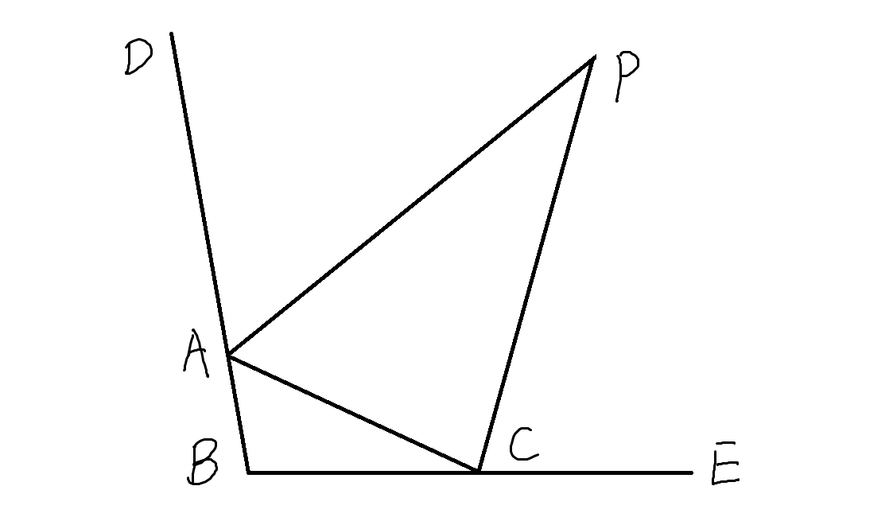
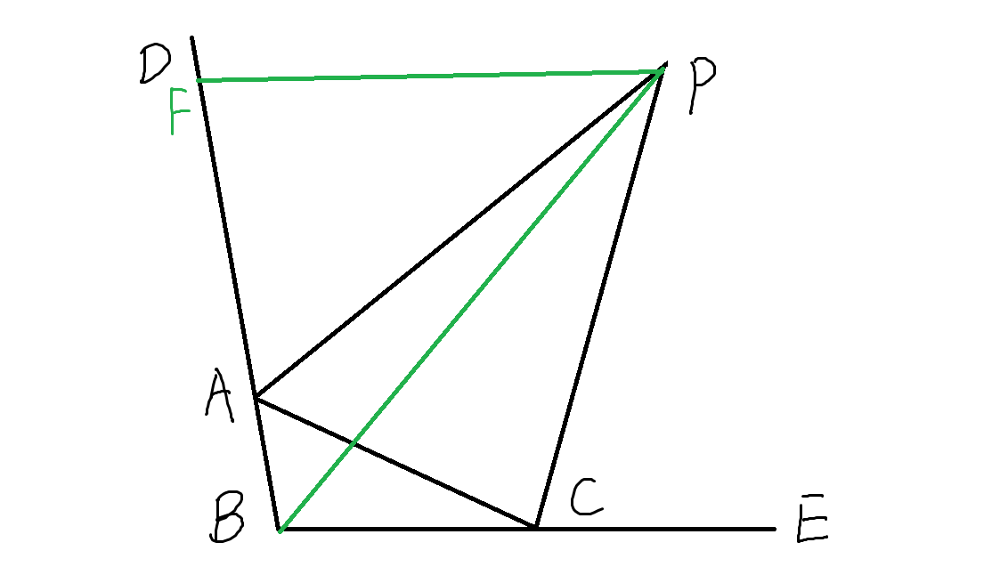
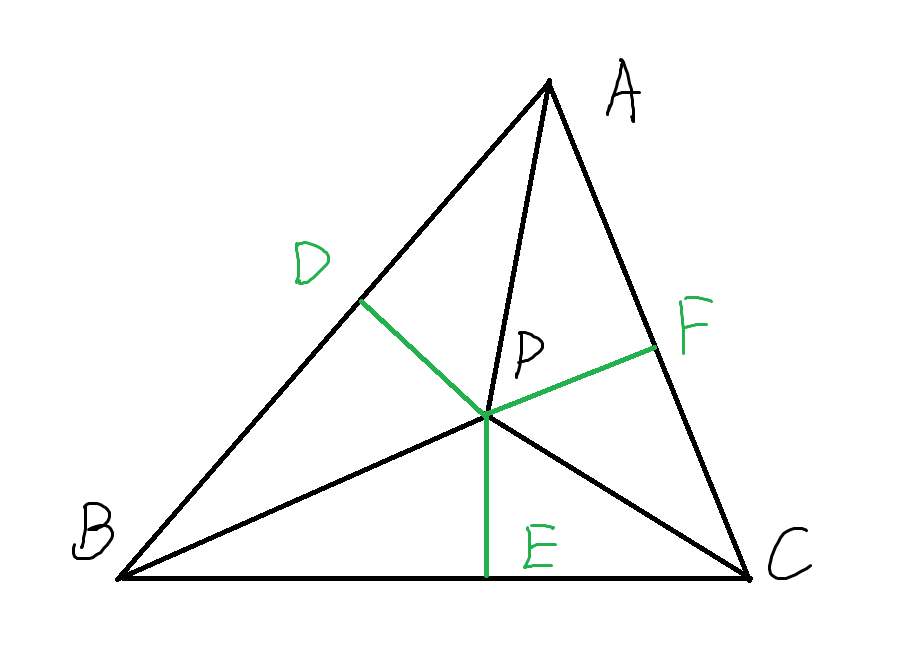

## 超难题001 几何选择压轴题
### 题目

$$
\begin{align}
& 如图，\angle DAC 与 \angle ACE 的角平分线相交于点P, 且 PC = AB + AC , \\
& 若 \angle PAD = 60 ^\circ, 则 \angle B 的度数是 (\qquad) \\
& A. 100 ^\circ \qquad B. 105 ^\circ \qquad C. 110 ^\circ \qquad D. 120 ^\circ
\end{align}
$$
### 解答

思路
$$
\begin{align}
&在AD上找一点F,使AF=AC, 连接PF, 则有 \\
& PC = AB + AC = AB + AF = BF \\
&\quad \left\{
\begin{array}{ll}
    PA = PA &\\
    \angle PAC = \angle PAF & \quad \Rightarrow \quad \triangle PAC \cong \triangle PAF\\
    AC = AF &\\
\end{array}
\right. \\
& \therefore PC = PF = BF \\
& \therefore \angle PAC = \angle PAF = 60 ^\circ,  \angle BAC = 60 ^\circ \\
& 连接PB, \\
& \because PF = BF, \quad \therefore \angle PBF = \angle BPF \\
& \because PA, PC分别是\angle BAC 和 \ ACB 的外角平分线, \\
& \therefore PB 平分 \angle ABC \quad (三角形的角平分线交于一点，详细证明见补充一) \\
& \angle PBC = \angle PBF = \angle BPF \\
& \therefore BC \parallel PF \\
& \therefore \angle ABC + \angle AFP = 180 ^\circ  \tag{1} \\
& \angle AFP = \angle ACP = \frac{1}{2} \angle ACE = \frac{1}{2} (\angle BAC + \angle ABC) = \frac{1}{2} (60 ^\circ + \angle ABC)  \tag{2} \\
& 由(1)(2)解得,  \angle ABC = 100 ^\circ \\
\end{align}
$$

### 答案
**A**
### 补充一
三角形三个内角平分线交于一点，这一点叫做内心。

交于一点证明思路:
两个角平分线的交点，和另一顶点的连线平分另一个角。

$$
\begin{align}
& 如图，BP, CP 分别是 \triangle ABC中 \angle B 、 \angle C 的角平分线。 \\
& 连接AP, 则AP 平分 \angle A \\
证明如下： & \\
& 作 PD 	\bot AB 于 D, PE \bot BC 于 E, PF \bot AC 于 F \\
& 易证 \triangle PBD \cong \triangle PBE,  \triangle PCE \cong \triangle PCF \\
& \therefore PD = PE = PF \\
& 易证 \triangle PAD \cong \triangle PAF \\
& \angle PAD = \angle PAF, \quad 即PA平分 \angle BAC \\
\end{align}
$$

同理可证，三角形两个角的外角平分线，和另一个角的内角平分线交于一点。
