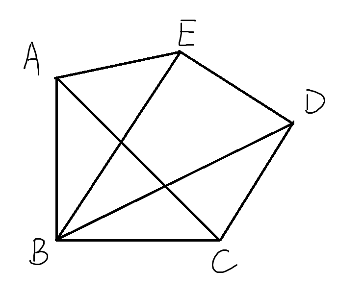
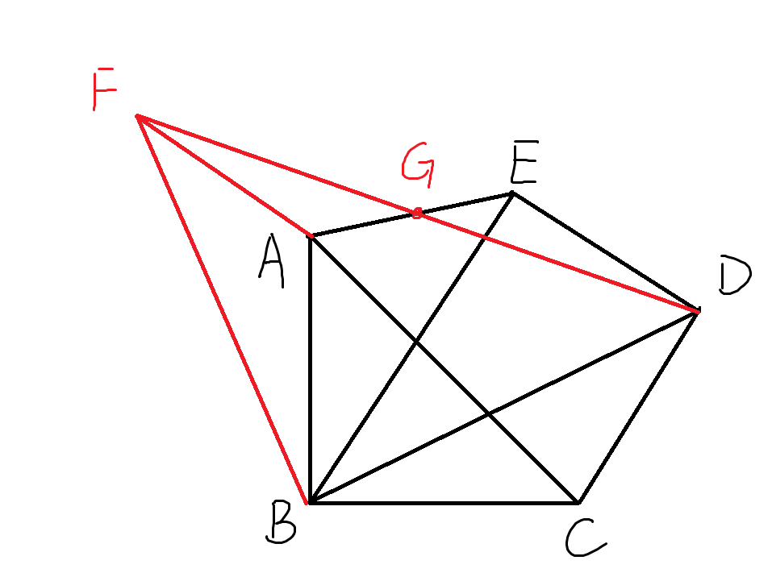
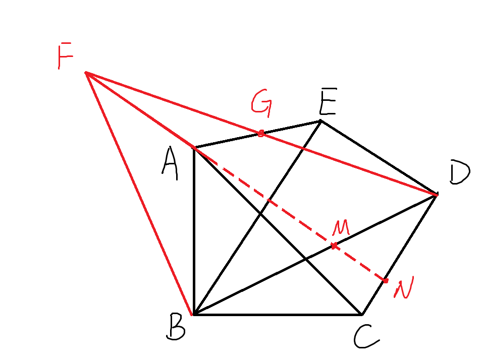

## 超难题003 全等三角形 手拉手模型 进阶题目
### 题目

$$
\begin{align}
& 如图，在五边形ABCDE中，\\ 
& \angle ABC = \angle CDE = \angle DEB = 90^\circ,\\ 
& AB = BC, CD = DE, BD=4, \\ 
& 则五边形ABCDE的面积为\_\_\_\_.
\end{align}
$$

### 解答

#### 思路

$$
\begin{align}
& 结合手拉手模型来思考，图中等腰直角三角形有：  \\
& \triangle ABC，\triangle EDC，其核心抓手是顶点和两个腰\\
& 题目又给了BD长度，发现\triangle BCD 汇聚的线索最多，\\
& 从这个三角形出发。思考如何创造手拉手模型。\\
& 现有的两个等腰直角三角形不共顶点，\\
& 那么就要再造一个等腰直角三角形，此时思路有两条，\\
& 1. 把 \triangle BCD 绕点B旋转至BC与AB重合，\\
& 2. 把\triangle BCD 绕点D旋转至DC与DE重合，\\
& 其实这两个思路是等价的，这里我们用第一个\\
\end{align}
$$

#### 简略答案
由于这是一个小题，所以先展示一个简略的答案思路，后面会有详细的论证。

$$
\begin{align}
& 将\triangle BCD 绕点B旋转至C与A重合,\\
& D的对应点记为F,连接DF, 交AE于点G。 \\
& 则 \triangle BDF也是等腰直角三角形。 \\
& 与 \triangle ABC 构成手拉手模型，\triangle BCD \cong \triangle BAF  \\
& 手拉手的结论： 全等三角形的第三条边相等，\\
& 且夹角等于等腰三角形顶角（这里是直角）。\\
& 即AF = CD = DE, AF \perp CD \\
& \because DE \perp CD, \therefore DE \parallel AF，又  DE = AF\\
&  易证 \triangle DEG \cong \triangle FAG (ASA) \\
& \therefore S_{\triangle BCD} = S_{\triangle BAF}, S_{\triangle DEG} = S_{\triangle FAG}\\
& \therefore S_{五边形ABCDE} = S_{\triangle BFD} = \frac 1 2 BD \cdot BF = 8\\
\end{align}
$$

**答案为8**

#### 详细论证

$$
\begin{align}
& 作BF\perp BD, 且BF = BD,连接DF, 交AE于点G。 \\
& \because \angle FBD = \angle ABC = 90 ^\circ , \therefore \angle FBA = \angle DBC  \\
& 在\triangle FBA 和 \triangle DBC 中\\
& \begin{cases}
BF = BD \\
\angle FBA = \angle DBC \\
BA = BC
\end{cases}\\
& \therefore \triangle FBA \cong \triangle DBC (SAS) \\
& \therefore AF = CD = DE \\
& 延长FA交BD于点M，交CD于点N \\
& 则 \angle BMF = \angle NMD, 又 \angle BFA = \angle BDC \\
& \therefore \angle MND = \angle MBF = 90 ^\circ, 即FA \perp CD  \\
& \because DE \perp CD,\\
&  在 \triangle DEG 和 \triangle FAG中\\
& \begin{cases}
\angle GDE = \angle GFA \\
DE = FA \\
\angle GED = \angle GAF \\
\end{cases}\\
&  \therefore \triangle DEG \cong \triangle FAG (ASA) \\
& \therefore S_{\triangle BCD} = S_{\triangle BAF}, S_{\triangle DEG} = S_{\triangle FAG}\\
& \therefore S_{五边形ABCDE} = S_{\triangle BFD} = \frac 1 2 BD \cdot BF = 8\\
\end{align}
$$

pandoc -t pptx -o test.pptx q12_2.md