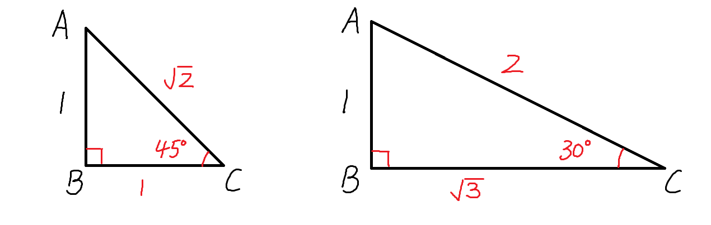
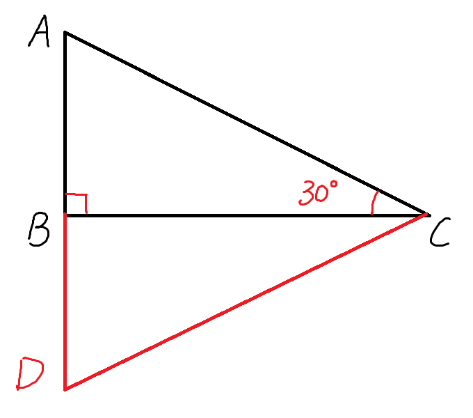
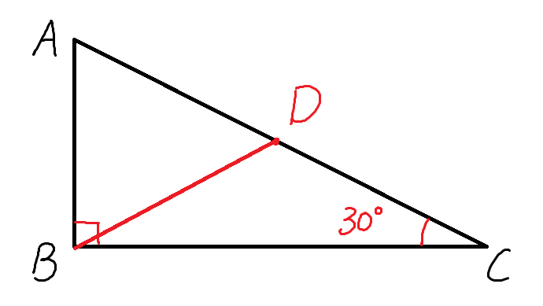
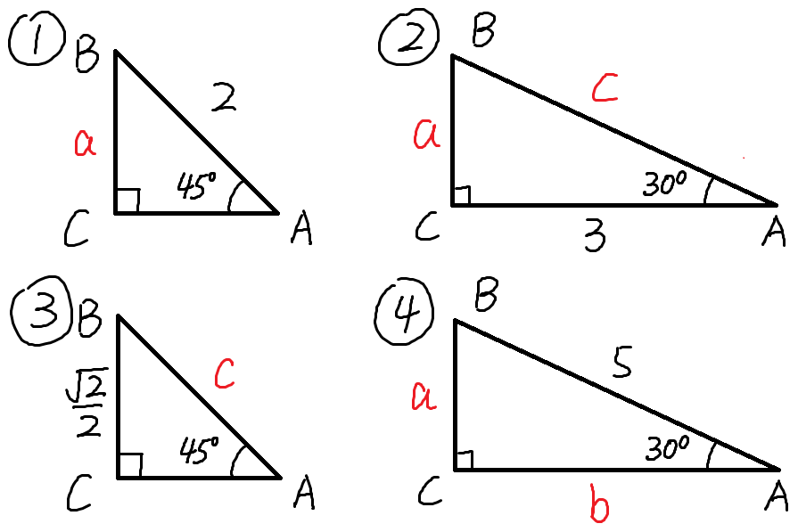
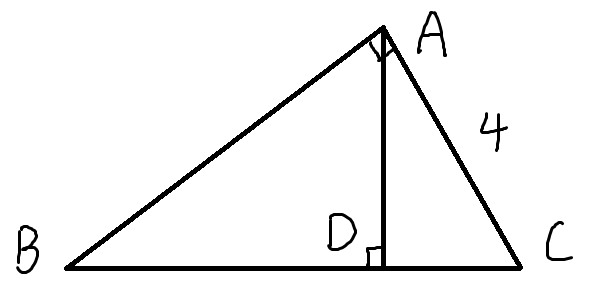
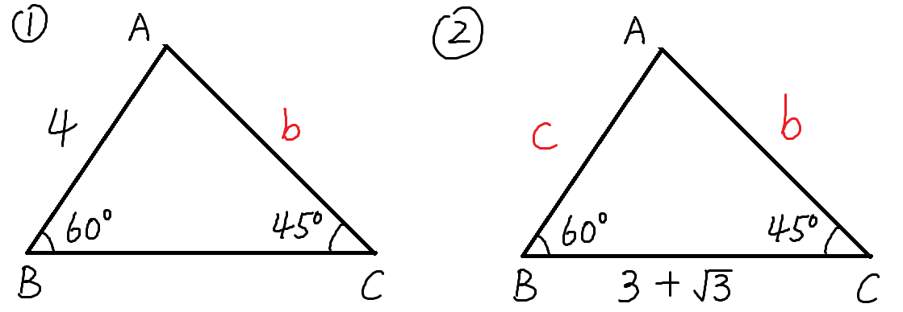
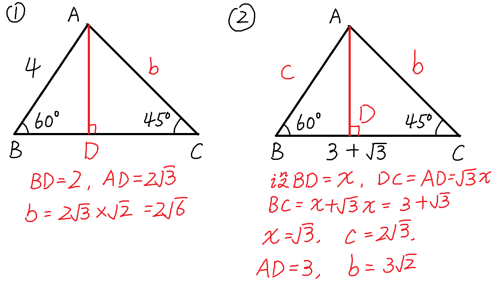

## 【初中数学】特殊角度的直角三角形（30度、45度）

> 适用范围: 初二下学期，学完勾股定理（人教版 第17章）之后。

### 核心掌握
$30^\circ$ 和 $45^\circ$ 度的直角三角形的边的关系如下。

**注意：图中数字展示的是边之间的倍数关系。**

即以下两个结论（重点）
- **等腰直角三角形，斜边是直角边的$\sqrt 2$倍**
- **在$30^\circ$的直角三角形中，$30^\circ$所对的直角边是斜边的一半。**
  **($60^\circ$所对的直角边是$30^\circ$所对的直角边的$\sqrt 3$倍)**

### 详细证明
#### 等腰直角三角形
$$
不妨设一条直角边长为a, \\
则另一条直角边也为a (等腰)\\
根据勾股定理，斜边的长为 \\
\sqrt {a^2 + a^2} = \sqrt {2a^2} = \sqrt 2 a \\
即斜边是直角边的\sqrt 2倍
$$
#### 30度的直角三角形
关键是证明出
**$30^\circ$所对的直角边是斜边的一半。**

之后的 ($60^\circ$所对的直角边是$30^\circ$所对的直角边的$\sqrt 3$倍)则可以用勾股定理很快得到。

这里提供两种证明方式，一简单，一稍复杂。

**证法1：翻折创造等边三角形**

$$
\begin{align}
& 如图所示，延长AB至D, 使得BD=AB \\
& \begin{cases}
BC = BC \\
\angle ABC = \angle DBC = 90^\circ \quad \Rightarrow \quad \triangle ABC \cong \triangle DBC (SAS)\\
AB = DB
\end{cases} \\
& \therefore \angle D = \angle A = 60^\circ, \triangle ADC 是等边三角形。 \\
& \therefore AC = AD = 2 AB \\
\end{align}
$$

**证法2：斜边中线**
> 定理: 直角三角形斜边上的中线等于斜边的一半。
> 平行四边形那一章节里会学到该定理(人教版 第十八章 初二下学期)。

$$
\begin{align}
& 如图，取AC中点D，连接BD。\\
& \because 直角三角形斜边上的中线等于斜边的一半\\
& \therefore BD = \frac 1 2 AC = AD = DC \\
& \because 等腰\triangle ADB 中，\angle A = 60^\circ \\
& \therefore \triangle ADB 是等边三角形\\
& (有一个角是60^\circ的等腰三角形是等边三角形) \\
& AB = AD = \frac 1 2 AC
\end{align}
$$

之后根据勾股定理可得

$BC = \sqrt {AC^2 - AB^2} = \sqrt {(2AB)^2 - AB^2} = \sqrt3 AB $

### 基础练习1
如下图所示，求出每一个特殊三角形中，对应的边长(红色标记的字母)

### 基础练习2
$$
如下图所示，\triangle ABC中，\angle BAC=90^\circ，\angle C=60^\circ，\\
 AC=4，AD \perp BC，求BD的长。
$$

### 拓展练习
如下图所示，求出每一个特殊三角形中，对应的边长(红色标记的字母)

### 答案
**基础练习1**
1. $a = \sqrt 2$
2. $a = \sqrt 3， c = 2 \sqrt 3$
3. $c = 1$
4. $a = \frac 5 2， b = \frac 5 2 \sqrt 3$

**基础练习2**
BD=6

思路: $BC= 2AC= 8, DC=\frac 1 2 AC = 2, BD= BC - DC = 6$

**拓展练习**
1. $b = 2\sqrt 6$
2. $b = 3 \sqrt 2， c = 2 \sqrt 3$

思路如下图:

