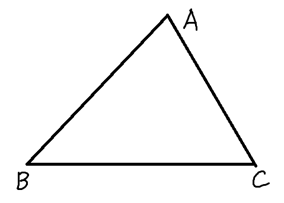
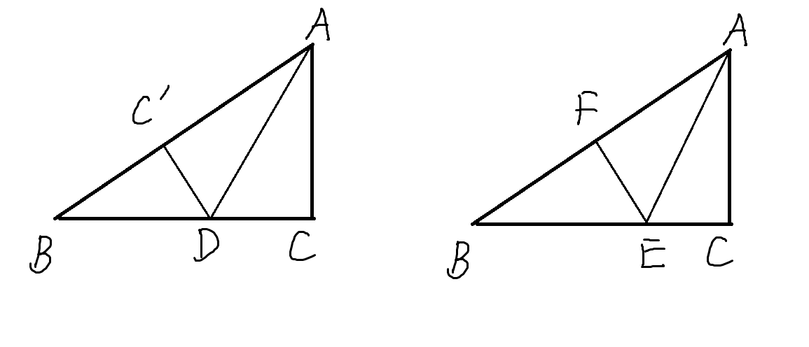
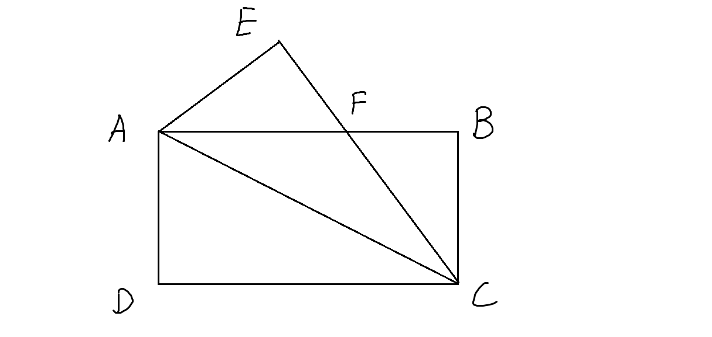
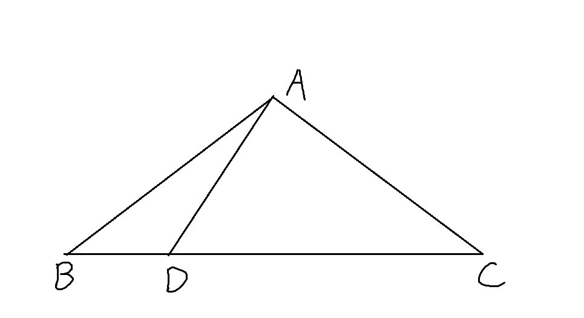
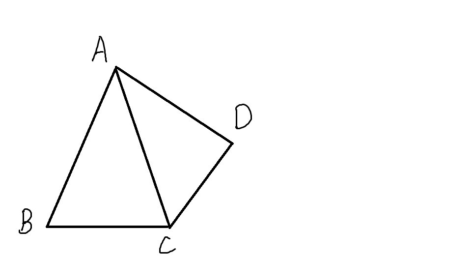

## 勾股定理经典题型

1. 如下图，在 $\triangle ABC$ 中， AB=14, BC=15, AC=13, 则 $\triangle ABC$ 的面积为 ______

2. 如下图(左)，$\triangle ABC$中，AB=5, BC=4, AC=3, 将边AC对折到AB上，折痕为AD，CD的长为 ______

3. 如上图(右)，$\triangle ABC$中，AB=5, BC=4, AC=3, 将顶点B对折到顶点A，折痕为EF，CE的长为 ______

4. 如下图，将长方形ABCD沿对角线AC折叠，点D的对应点为E， CE交AB于点F， 若AB=8， BC=4, AF的长为 ______

**后面的题目较难（选择填空压轴题）**

5. 如下图，在 $\triangle ABC$ 中，
AB = AC = 10, BC = 16, AD $\perp$ AC 交 BC 于点D, 则DB的长为 ______

6. 如下图，在四边形ABCD中， CD $\perp$ AD, CD平分 $\triangle ABC$ 的一个外角，$\angle B = \angle BAD$， 若AC = 5， BC=3， 则 $\triangle ABC$ 的面积为 ______

---

### 参考答案：
#### 1. $84$

#### 2. $\frac {3} {2}$
#### 3. $\frac {7} {8}$
#### 4. $5$
#### 5. $3.5$
#### 6. $\frac {36} {5}$
