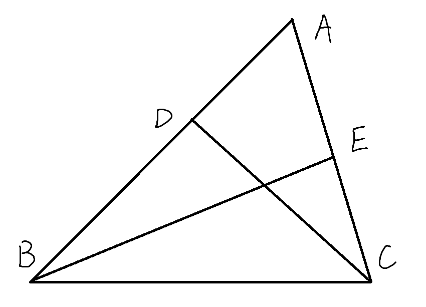
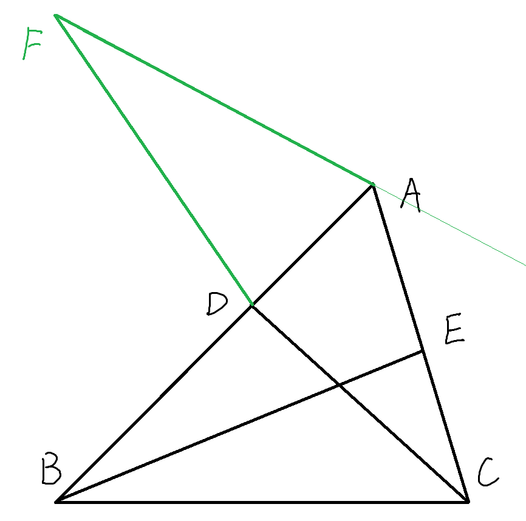
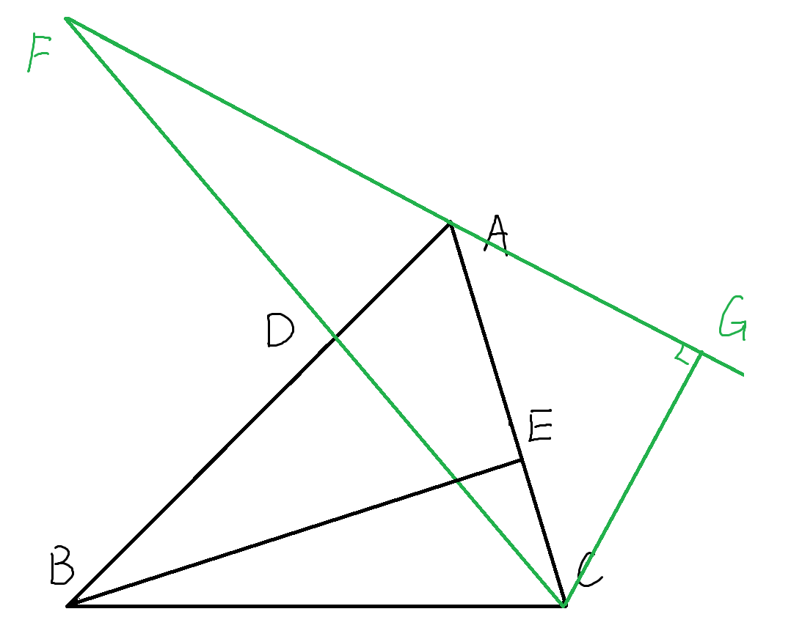
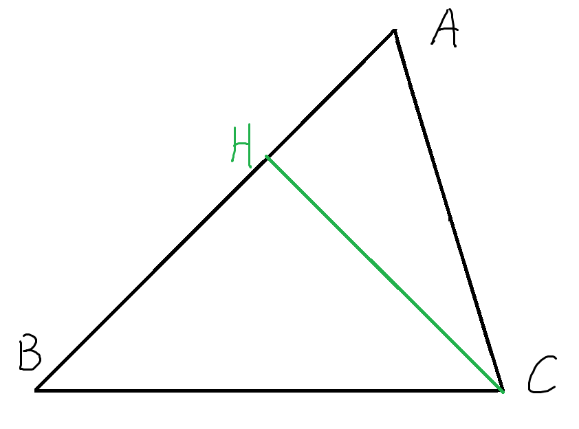

## [初中数学】超难题002 一道几何选择压轴题（最短路径综合题）
### 题目
> 适用阶段：初二下学期。（学完勾股定理后）

$$
\begin{align}
& 如图，在\triangle ABC中，\angle A = 60 ^\circ, \angle ABC = 45 ^\circ, AC=4, \\
& 点D, E分别为边AB, AC上的动点，且AD=CE，\\
& 记m=CD+BE，S = S_{ \triangle ACD} + S_{\triangle BCE}, \\
& 当m取最小值时，S的值为 \_\_\_\_\_\_.
\end{align}
$$

---
解答见下方。
本段为分隔符，无实际意义。
只是防止直接看到解答影响思路。
。
。
。
。
。
。
。
。
。
。

---
### 0 总分析
> 类似的超难题目，在我看来，已经不是一个题目了，而是多个题目的合体。
把这些子问题拆分明白，掌握清楚，是超难题目的基本功。

这个题目其实分为三大步，
或者说，可以拆分为三个问题，来依次解决。

### 1 什么情况下m最小
> **回顾**：最短问题的经典题目是，将军饮马问题。
> 将军饮马问题的核心思想为：
> 通过做对称点，把路径（所有折线）转化成两个点之间的距离。

#### 思路分析推演
在这个问题中，$m=CD+BE$
求$m$的最小值，就是求$CD$和$BE$两段折线的和的最小值。

*这个时候，不能简单的直接使用点到直线间垂线段最短, 让$CD \perp AB, BE \perp AC$。*
*因为D和E是有联系，相互影响的，即 $AD = CE$ ,*
*所以 $CD \perp AB$ 时 不一定有 $BE \perp AC$*

那么这个时候怎么做呢。
思考下之前最短路径的核心解决思想。
要把路径（所有折线）转化成两个点之间的距离。
那么首先要把折线连接起来。
把边CD或者边BE怎么旋转或变换，变换后两端折现可以拼一起？

而边的变换往往是通过三角形的变换来完成。
题目中又有$AD = CE$
那么能想到的是变换$\triangle ADC$和$\triangle BCE$

变换后，D应该和E重合，然后DA应该和CE重合。
不妨变换$\triangle BCE$，CE和AD重合时，B有两个位置可选，
由于C点已经在AB边的右下这一半区域。
B应该选择AB的另一半区域，也就是左上区域。

那么这个办法就出来了

#### 参考答案

$$
\begin{align}
& \because \angle ABC = 45 ^\circ, \angle BAC = 60 ^\circ \\
& \therefore \angle ACB = 180^\circ - 45^\circ - 60^\circ =75 ^\circ \\
& 如图，过点A做\angle BAF = \angle ACB = 75 ^\circ，AF=BC, 连接FD\\
& \begin{cases}
AD=CE, \\
\angle BAF = \angle ACB, \qquad \Rightarrow \triangle ADF \cong \triangle CEB  (SAS) \\
AF=BC, \\
\end{cases} \\
& \therefore EB = DF, \\
& m = BE + CD = CD + DF \\
& 由于F点是固定的，所以m此时为F到C之间的两端折线的和。 \\
& \because 两点之间，线段最短。\\
& 连接FC，m最短即为FC，此时D为AB与FC的交点。
\end{align}
$$
### 2 在1的情况下，S要怎么求
#### 思路分析推演
因为有$\triangle ADF \cong \triangle CEB$
又因为m最小时，D在FC上
所以此时$S = S_{ \triangle ACD} + S_{\triangle BCE} =S_{ \triangle ACD} + S_{\triangle ADF} = S_{ \triangle AFC} $

三角形面积的根本公式是 $ S = \frac 1 2 底 \times 高$

$\triangle AFC$ 就三个边可以作为底，那么就是从这里面选择一个底，然后去做底的高来求。

实际上选择AC或AF做底，算起来都差不多。
这里不妨选择以AF为底，过C做AF上的高。
那么方法就如下

#### 参考答案

$$
\begin{align}
& 如图，做CG \perp AF 交FA延长线于点G \\
& \angle FAD = \angle BCE = 75 ^\circ \\
& \therefore \angle CAG = 180^\circ - 75^\circ - 60^\circ = 45^\circ \\
& \therefore \triangle CAG 是等腰直角三角形 \\
& \therefore CG = \frac {\sqrt2} {2} AC = \frac {\sqrt2} {2} \times 4 = 2\sqrt2 \\
& S = \frac 1 2 CG \times AF =\sqrt2 AF
\end{align}
$$

那么下来的问题就是求AF。

### 3 怎么求AF(BC)

#### 思路分析推演
因为有$\triangle ADF \cong \triangle CEB$
所以AF=BC，也就是要求BC的长度。

BC在$\triangle ABC$中，
那么现在来分析下这个三角形的
知道三个角的度数，且还有两个特殊角度$45^\circ$ 和 $60^\circ$，和一个边的长度$AC=4$
要把特殊角度用起来就要构造直角三角形
，也就是过点做高，同时又要能用到边AC。

那么这个时候的辅助线画法就是过C做AB边上的高。
那么方法就如下

#### 参考答案

$$
\begin{align}
& 如图，做CH \perp AB 交AB于点H \\
& \because \angle HAC = 60^\circ \\
& \therefore AH = \frac 1 2 AC = 2, HC = \sqrt 3 AH = 2\sqrt3 \\
& \because \angle HBC = 45^\circ  \\
& \therefore BC = \sqrt2 CH = \sqrt2 \times 2\sqrt3 = 2 \sqrt6
\end{align}
$$

### 最终答案
所以$AF = BC = 2\sqrt6$
最后答案为$S = \sqrt2 AF = \sqrt2 \times 2\sqrt6 = 4 \sqrt3 $

**正确答案为$ 4 \sqrt3 $**
