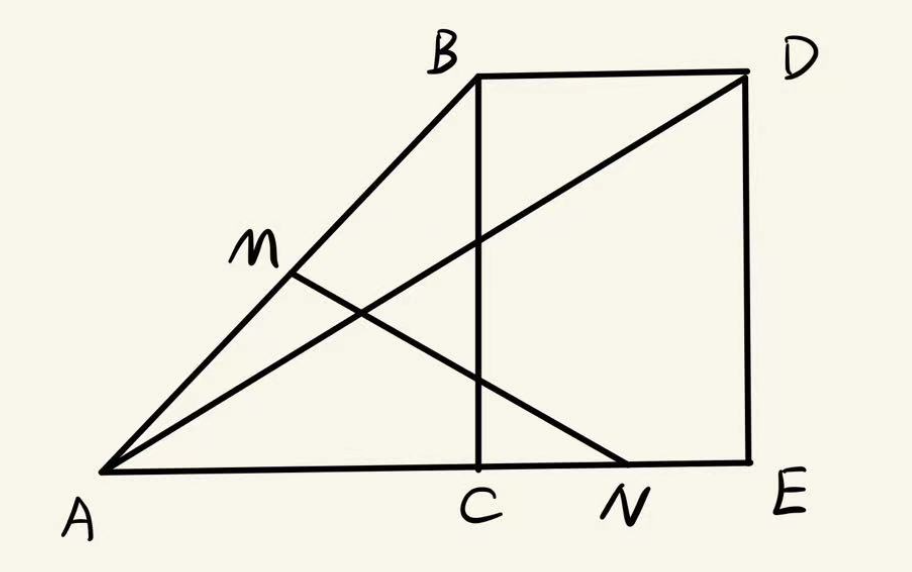
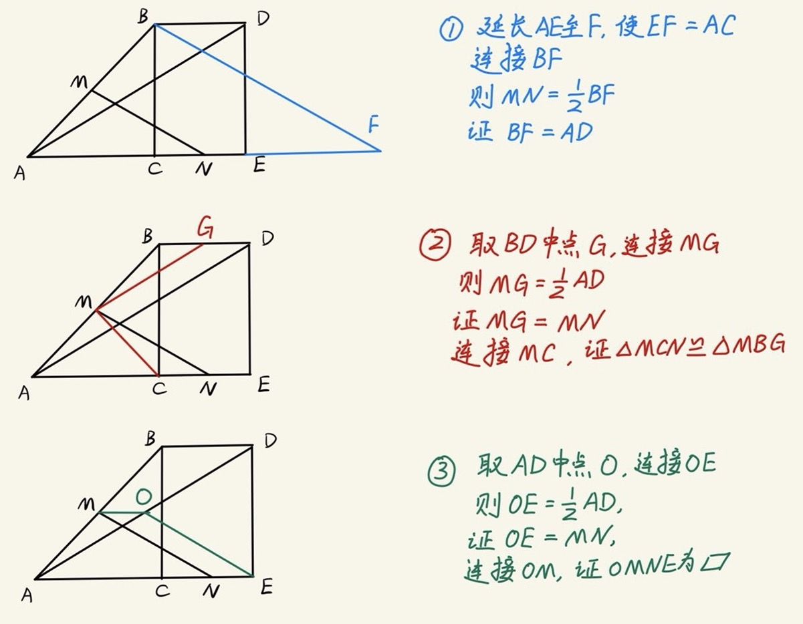
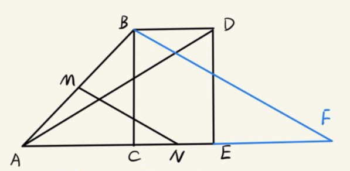
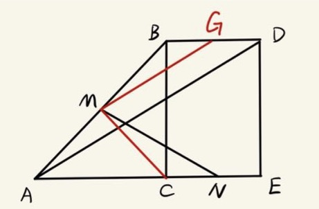
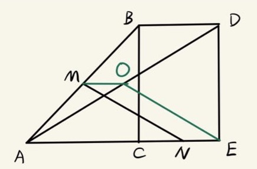

## 【初中数学】一题多思路 1801 一道几何证明题
> 适用阶段： 初二下学期，学完平行四边形。

### 题目
$$
如图， 在\triangle ABC, \triangle ADE 中， \angle BCA = \angle DEA = 90 ^\circ, \\ A,C,E 在一条直线上，且BC=DE，连接BD， \\
M，N分别为AB， CE的中点，连接MN。\\
求证： AD= 2MN
$$

### 思路分析
这个题有多种思路，非常灵活。
这里做一下如何想到这些思路的分析。

要证明AD= 2MN，
那么有两种大方向
- 把MN放大成两倍，证明放大两倍后的和AD相等
- 把AD缩小成一半，证明缩小一半后的和MN相等

结合题目，出现两次中点。
遇到中点，联想到中位线以及中线。

那么到这里，辅助线应该就好思考了。

### 三种思路
1. 把MN作为中位线（对应的边为其两倍）
2. 找到AD对应的中位线（该中位线为AD的一半）
3. 画AD边上的中线（直角三角形斜边上中线等于斜边一半）

具体如下图所示

下来逐一证明
### 思路一

$$
\begin{aligned}
& 延长AE至F，使EF=AC \\
& \because N为CE中点，\therefore NC = NE \\
& \therefore AC + CN = EF + NE, 即AN=NF \\
& \because M为AB中点，N为AF中点， \\
& \therefore MN为 \triangle ABF中位线, MN = \frac 1 2 BF \\
& AC + CE = EF + CE, 即 AE = CF \\
& \begin{cases}
AE = CF \\
\angle DEA = \angle BCF \\
DE = BC \\
\end{cases} \\
& \therefore \triangle ADE \cong \triangle FBC \\
& \therefore AD = BF = 2MN
\end{aligned}
$$

### 思路二

$$
\begin{aligned}
& 取BD中点G，连接MG，MC \\
& M为AB中点，MG为\triangle ABD 中位线， MG = \frac 1 2 AD \\
& \because \angle BCA = \angle DEA = 90 ^\circ, \therefore BC \parallel DE \\
& 又BC= DE， \therefore BCED 是平行四边形 \\
& \therefore BD \parallel CE , \angle CBD = \angle BCA = 90 ^ \circ \\
& G， N分别为BD， CE中点, \because BD = CE, \therefore BG = CN \\
& \because \angle ACB = 90 ^ \circ, CM为斜边AB的中线, \therefore CM = \frac 1 2 AB = MB \\
& \angle MCB = \angle MBC, 又\angle BCE = \angle CBD, \therefore \angle MCN = \angle MBG  \\
& \begin{cases}
MC = MB \\
\angle MCN = \angle MBG \quad \Rightarrow \quad \therefore \triangle MCN = \triangle MBG \\
CN = BG
\end{cases} \\
& MN = MG = \frac 1 2 AD, 即AD = 2 MN
\end{aligned}
$$
### 思路三

$$
\begin{aligned}
& 取AD中点O，连接MO，OE \\
& M为AB中点，\therefore MO 为\triangle ABD 中位线 \\
& MO = \frac 1 2 BD, MO \parallel BD \\
& \because \angle BCA = \angle DEA = 90 ^\circ, \therefore BC \parallel DE \\
& \because BC = DE, \therefore BCED为平行四边形 \\
& BD = CE, BD \parallel CE \\
& N为CE中点，\therefore NE = \frac 1 2 CE = \frac 1 2 BD = MO \\
& \because MO \parallel BD, NE \parallel BD, \therefore MO \parallel NE \\
& \therefore MOEN 为平行四边形 ,\therefore MN = OE \\
& \angle AED = 90 ^\circ , EO 为斜边AD中线 \\
& \therefore AD = 2 OE = 2 MN \\
\end{aligned}
$$
